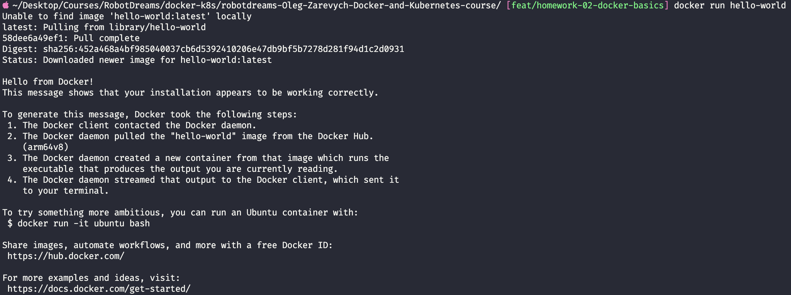
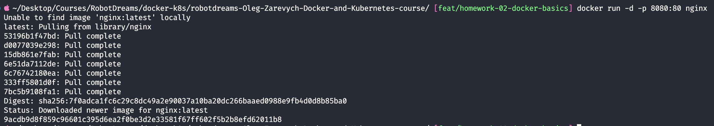
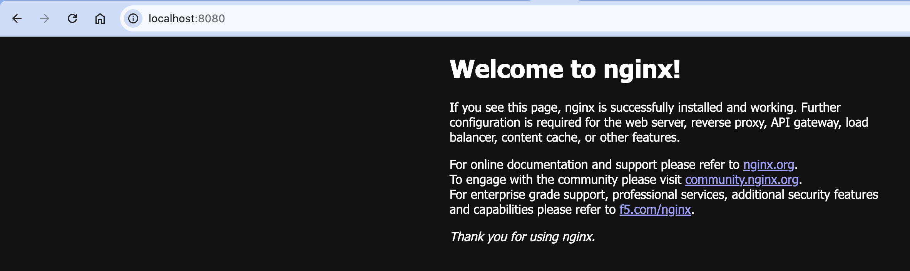
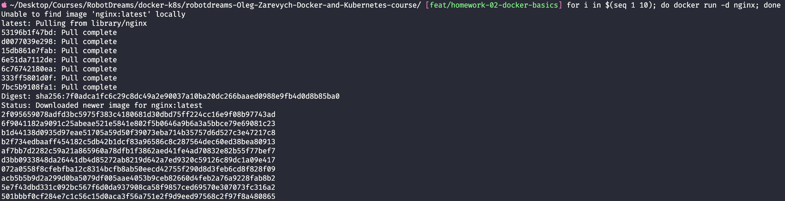
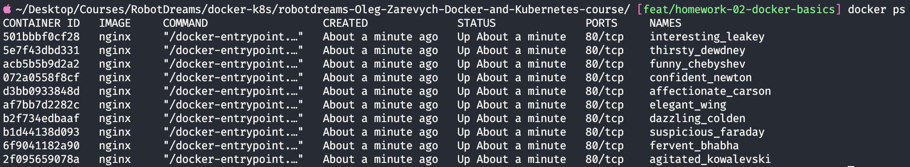
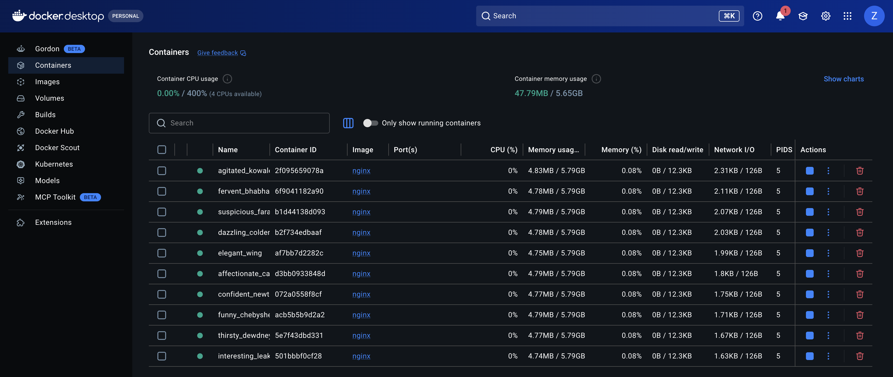
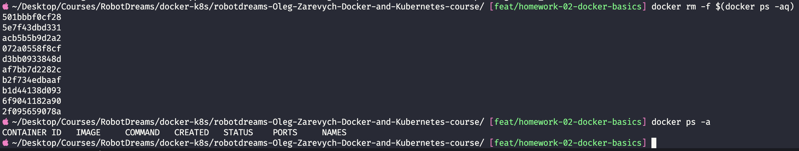

# Домашнє завдання #02 — Основи Docker

## Зміст

- [Середовище](#середовище)
- [Завдання 1 — Встановлення Docker Desktop](#завдання-1--встановлення-docker-desktop)
- [Завдання 2 — Перший контейнер hello-world](#завдання-2--перший-контейнер-hello-world)
- [Завдання 3 — Запуск nginx на порту 8080](#завдання-3--запуск-nginx-на-порту-8080)
- [Завдання 4 — Запуск 10 контейнерів nginx](#завдання-4--запуск-10-контейнерів-nginx)
- [Завдання 5 — Зупинити та видалити всі контейнери](#завдання-5--зупинити-та-видалити-всі-контейнери)
- [Висновки](#висновки)

---

## Середовище

| Параметр       | Значення                     |
| -------------- | ---------------------------- |
| OS             | macOS (Apple Silicon, arm64) |
| Docker         | Docker Desktop               |
| Shell          | zsh                          |
| Дата виконання | 11 квітня 2026               |

---

## Завдання 1 — Встановлення Docker Desktop

Docker Desktop — це графічний інструмент для роботи з Docker на macOS/Windows. Під капотом він запускає Docker daemon (dockerd), який керує контейнерами, образами та мережами.

> 💡 **Аналогія:** Docker Desktop — це як "пульт керування" для Docker. Сам Docker — двигун, Desktop — зручна панель з кнопками.

Перевірка встановлення:

```bash
docker --version
```

✅ Docker Desktop встановлено та працює.

---

## Завдання 2 — Перший контейнер hello-world

### Що таке `docker run`?

`docker run` — головна команда Docker. Вона:

1. Шукає образ локально
2. Якщо не знаходить — скачує з Docker Hub
3. Створює контейнер з образу
4. Запускає його

### Команда

```bash
docker run hello-world
```

### Що відбулось

```
Unable to find image 'hello-world:latest' locally
latest: Pulling from library/hello-world
58dee6a49ef1: Pull complete
Digest: sha256:452a468a...
Status: Downloaded newer image for hello-world:latest

Hello from Docker!
```

Docker виконав 4 кроки:

1. Docker client звернувся до Docker daemon
2. Daemon скачав образ `hello-world` з Docker Hub (arm64v8 — для Apple Silicon)
3. Створив контейнер з образу
4. Вивів повідомлення в термінал

### Скріншот



✅ Перший контейнер успішно запущено.

---

## Завдання 3 — Запуск nginx на порту 8080

### Що таке nginx у контейнері?

nginx — веб-сервер. У контейнері він слухає порт `80` всередині. Щоб отримати до нього доступ з хост-машини, треба зробити **port mapping** — прокинути порт назовні.

> 💡 **Аналогія:** Контейнер — це квартира в багатоповерхівці. Порт 80 — це вхідні двері квартири. Port mapping (`-p 8080:80`) — це як домофон на вході в будинок: набираєш `8080` (зовні) → потрапляєш до квартири на порт `80`.

### Команда

```bash
docker run -d -p 8080:80 nginx
```

| Прапорець    | Значення                                                |
| ------------ | ------------------------------------------------------- |
| `-d`         | detached — запуск у фоновому режимі                     |
| `-p 8080:80` | port mapping: порт 8080 на хості → порт 80 в контейнері |

### Скріншоти



Відкриваємо браузер: `http://localhost:8080`



✅ nginx успішно запущено, сторінка **"Welcome to nginx!"** відкривається в браузері.

---

## Завдання 4 — Запуск 10 контейнерів nginx

### Автоматизація через bash loop

Замість того щоб запускати 10 команд вручну — використовуємо bash цикл `for`.

> 💡 **Аналогія:** Це як штамп на заводі — замість ліпити кожну деталь руками, просто натискаємо 10 разів.

### Команда

```bash
for i in $(seq 1 10); do docker run -d nginx; done
```

| Частина               | Значення                  |
| --------------------- | ------------------------- |
| `seq 1 10`            | генерує числа від 1 до 10 |
| `for i in ...`        | ітерує по кожному числу   |
| `docker run -d nginx` | запускає контейнер у фоні |

> Зверни увагу: цього разу без `-p`, бо 10 контейнерів не можуть всі слухати один і той самий порт хоста.

### Скріншоти



Перевіряємо що всі 10 запущені:

```bash
docker ps
```





✅ Всі 10 контейнерів nginx успішно запущені. Docker автоматично присвоїв їм випадкові імена (`agitated_kowalevski`, `fervent_bhabha`, тощо).

---

## Завдання 5 — Зупинити та видалити всі контейнери

### Одна команда замість десяти

Замість зупиняти кожен контейнер окремо — використовуємо підстановку команди `$()`.

> 💡 **Аналогія:** `docker ps -aq` — це список всіх "жильців". `docker rm -f` — це виселення. Замість виселяти кожного окремо, передаємо весь список одразу.

### Команда

```bash
docker rm -f $(docker ps -aq)
```

| Частина         | Значення                                                            |
| --------------- | ------------------------------------------------------------------- |
| `docker ps -aq` | виводить ID всіх контейнерів (`-a` всі, `-q` тільки ID)             |
| `docker rm -f`  | примусово зупиняє і видаляє контейнери                              |
| `-f` (force)    | не потрібно спочатку зупиняти — видаляє одразу                      |
| `$()`           | підстановка — результат внутрішньої команди передається як аргумент |

### Перевірка

```bash
docker ps -a
```

### Скріншот



✅ Всі контейнери зупинені та видалені. `docker ps -a` повертає порожній список.

---

## Висновки

### Статус завдань

| #   | Завдання                                | Статус |
| --- | --------------------------------------- | ------ |
| 1   | Встановити Docker Desktop               | ✅     |
| 2   | Запустити `hello-world`                 | ✅     |
| 3   | Запустити nginx на порту 8080           | ✅     |
| 4   | Запустити 10 контейнерів nginx          | ✅     |
| 5   | Зупинити та видалити всі одною командою | ✅     |

### Корисні команди

```bash
# Запуск контейнера
docker run <image>                    # запустити контейнер
docker run -d <image>                 # запустити у фоні
docker run -d -p <host>:<container>   # з port mapping

# Перегляд контейнерів
docker ps                             # запущені контейнери
docker ps -a                          # всі контейнери
docker ps -q                          # тільки ID запущених
docker ps -aq                         # тільки ID всіх

# Зупинка і видалення
docker stop <id>                      # зупинити контейнер
docker rm <id>                        # видалити зупинений
docker rm -f <id>                     # примусово видалити запущений
docker rm -f $(docker ps -aq)         # видалити всі одразу

# Автоматизація
for i in $(seq 1 N); do docker run -d <image>; done  # запустити N контейнерів
```
