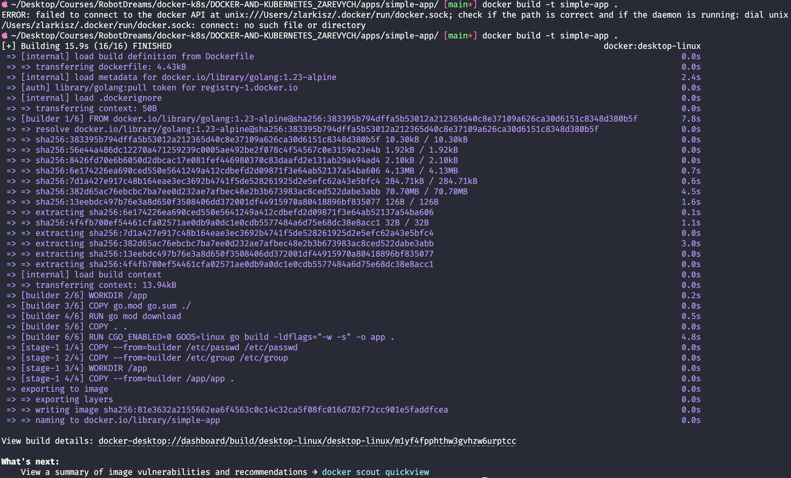
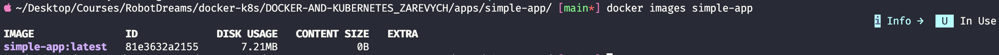
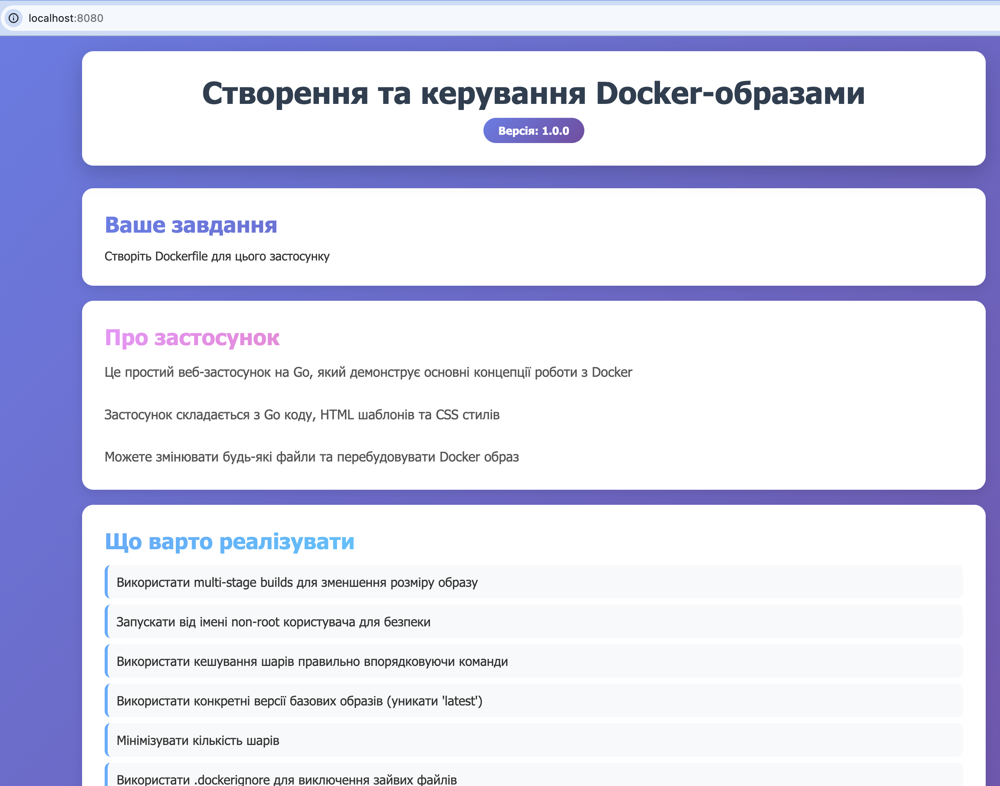
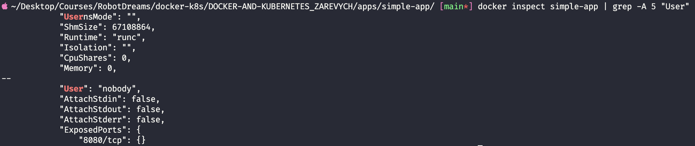
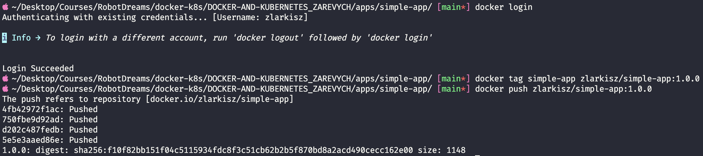
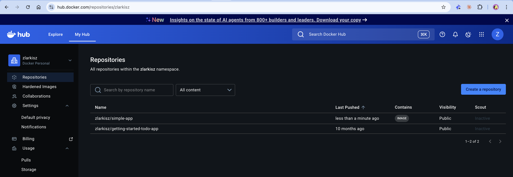
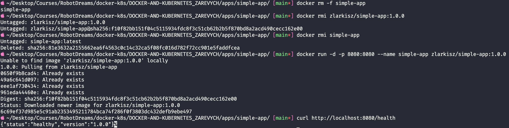

# Домашнє завдання #03 — Створення та управління Docker образами

## Зміст

- [Середовище](#середовище)
- [Завдання 1 — Написати Dockerfile з multi-stage build](#завдання-1--написати-dockerfile-з-multi-stage-build)
- [Завдання 2 — Збілдити образ локально](#завдання-2--збілдити-образ-локально)
- [Завдання 3 — Запустити контейнер та перевірити вимоги](#завдання-3--запустити-контейнер-та-перевірити-вимоги)
- [Завдання 4 — Публікація образу на Docker Hub](#завдання-4--публікація-образу-на-docker-hub)
- [Завдання 5 — Запуск образу з реєстру](#завдання-5--запуск-образу-з-реєстру)
- [Висновки](#висновки)

---

## Середовище

| Параметр        | Значення                     |
| --------------- | ---------------------------- |
| OS              | macOS (Apple Silicon, arm64) |
| Docker          | Docker Desktop               |
| Shell           | zsh                          |
| Мова застосунку | Go 1.23                      |
| Docker Hub      | zlarkisz/simple-app          |

---

## Завдання 1 — Написати Dockerfile з multi-stage build

### Що таке multi-stage build?

Multi-stage build — це техніка де один `Dockerfile` містить **кілька `FROM` інструкцій**. Кожна `FROM` — це окремий stage (етап). Фінальний образ містить тільки те, що ми явно скопіювали з попередніх stages.

> 💡 **Аналогія:** Уяви будівництво будинку. Stage 1 — будівельний майданчик з кранами, бетономішалками, робітниками. Stage 2 — готовий будинок де живуть люди. Мешканцям не потрібні крани і бетономішалки — вони залишаються на майданчику і не переїжджають разом з будинком.

### Структура застосунку `simple-app`

| Файл / Папка    | Призначення                                          |
| --------------- | ---------------------------------------------------- |
| `main.go`       | Точка входу, HTTP-сервер на порті 8080               |
| `go.mod`        | Декларація модуля та Go-версії (1.23)                |
| `go.sum`        | Хеші залежностей для верифікації                     |
| `templates/`    | HTML-шаблони (вбудовані в бінарник через `go:embed`) |
| `static/`       | CSS/JS файли (вбудовані в бінарник через `go:embed`) |
| `.dockerignore` | Файли які не потрапляють в build context             |

> 💡 Директиви `//go:embed` в Go дозволяють вшити статичні файли прямо в бінарник під час компіляції. Тому в фінальному образі потрібен тільки один файл — скомпільований бінарник `app`.

### Dockerfile

```dockerfile
# ╔══════════════════════════════════════╗
# ║  Stage 1 — BUILD                     ║
# ╚══════════════════════════════════════╝

# Базовий образ для компіляції: офіційний Go 1.23 на Alpine Linux
# Alpine — мінімальний дистрибутив (~5MB), містить компілятор Go
FROM golang:1.23-alpine AS builder

# Встановлюємо робочу директорію всередині контейнера
# Всі наступні команди (COPY, RUN) виконуються відносно /app
WORKDIR /app

# Копіюємо ТІЛЬКИ файли залежностей — go.mod і go.sum
# Хитрість: якщо змінився тільки код (main.go), але не залежності —
# Docker використає кеш цього шару і не буде знову качати модулі
COPY go.mod go.sum ./

# Завантажуємо всі Go-модулі (залежності) в кеш
# Це як npm install, але для Go
RUN go mod download

# Копіюємо весь код проєкту в контейнер
# Включає: main.go, templates/, static/ (вони вбудуються в бінарник через go:embed)
COPY . .

# Компілюємо Go-застосунок в бінарник
# CGO_ENABLED=0  — вимикаємо CGO, щоб бінарник не залежав від C-бібліотек
# GOOS=linux     — компілюємо під Linux (навіть якщо білдимо на macOS)
# -ldflags="-w -s" — прибираємо debug-символи: -w (DWARF), -s (symbol table)
#                    це зменшує розмір бінарника приблизно на 30%
# -o app         — називаємо вихідний файл "app"
RUN CGO_ENABLED=0 GOOS=linux go build -ldflags="-w -s" -o app .


# ╔══════════════════════════════════════╗
# ║  Stage 2 — RUN                       ║
# ╚══════════════════════════════════════╝

# scratch — абсолютно порожній образ (0 байт)
# Немає shell, немає утиліт, немає ОС — тільки наш бінарник
# Це можливо тільки тому що Go компілює статичний бінарник (CGO_ENABLED=0)
FROM scratch

# Копіюємо системні файли користувачів зі stage builder
# scratch не має /etc/passwd — без нього USER nobody не працює
# /etc/passwd — список користувачів системи (включає nobody)
# /etc/group  — список груп системи
COPY --from=builder /etc/passwd /etc/passwd
COPY --from=builder /etc/group /etc/group

# Робоча директорія в фінальному контейнері
WORKDIR /app

# Копіюємо ТІЛЬКИ скомпільований бінарник зі stage builder
# Весь Go-компілятор, вихідний код, залежності — залишаються в stage builder
# і НЕ потрапляють у фінальний образ. Це і є суть multi-stage build.
COPY --from=builder /app/app .

# Перемикаємось на нерут-користувача nobody (uid=65534)
# Якщо зловмисник зламає застосунок — він отримає мінімальні права
USER nobody

# Оголошуємо що контейнер слухає порт 8080
# EXPOSE — це документація, реальний маппінг робиться через -p при docker run
EXPOSE 8080

# Команда запуску контейнера
# Використовуємо exec form (масив) замість shell form ("./app")
# бо в scratch немає shell (/bin/sh) — shell form просто не запуститься
CMD ["./app"]
```

### Ключові рішення

| Рішення                                 | Причина                                                  |
| --------------------------------------- | -------------------------------------------------------- |
| `golang:1.23-alpine` для білду          | Мінімальний образ з компілятором (~300MB)                |
| `go mod download` окремо від `COPY . .` | Кешування шару з залежностями — прискорює повторні білди |
| `CGO_ENABLED=0`                         | Статичний бінарник без libc — необхідно для `scratch`    |
| `scratch` для рантайму                  | Порожній образ, нуль зайвого — максимальна безпека       |
| `-ldflags="-w -s"`                      | Зменшення розміру бінарника на ~30%                      |
| `nobody` через `/etc/passwd`            | Нерут-користувач без `useradd` у `scratch`               |
| `CMD ["./app"]` exec form               | У `scratch` немає `/bin/sh` для shell form               |

✅ Dockerfile написано з дотриманням усіх вимог.

---

## Завдання 2 — Збілдити образ локально

### Що робить `docker build`?

`docker build` читає `Dockerfile` і збирає образ крок за кроком. Кожна інструкція (`FROM`, `RUN`, `COPY`) — це окремий шар який кешується.

```bash
docker build -t simple-app .
```

| Частина         | Значення                                                      |
| --------------- | ------------------------------------------------------------- |
| `docker build`  | команда збірки образу                                         |
| `-t simple-app` | тег (ім'я) образу, повна форма: `simple-app:latest`           |
| `.`             | build context — поточна папка відправляється до Docker daemon |

> 💡 **Аналогія:** `.` (крапка) — це як запакувати посилку з поточної папки і відправити на завод (Docker daemon). Завод може використовувати тільки те що є в посилці.

### Скріншот



### Що відбулось під час білду

```
[builder 1/6] FROM golang:1.23-alpine    ← завантажив базовий образ
[builder 2/6] WORKDIR /app               ← створив робочу директорію
[builder 3/6] COPY go.mod go.sum ./      ← скопіював файли залежностей
[builder 4/6] RUN go mod download        ← завантажив Go-модулі
[builder 5/6] COPY . .                   ← скопіював весь код
[builder 6/6] RUN CGO_ENABLED=0 ...     ← скомпілював бінарник (4.8s)

[stage-1 1/4] COPY /etc/passwd           ← скопіював користувачів
[stage-1 2/4] COPY /etc/group            ← скопіював групи
[stage-1 3/4] WORKDIR /app               ← робоча директорія
[stage-1 4/4] COPY /app/app .            ← тільки бінарник у фінальний образ!
```

### Розмір образу

```bash
docker images simple-app
```



| Образ                                 | Розмір      |
| ------------------------------------- | ----------- |
| `golang:1.23-alpine` (builder stage)  | ~300 MB     |
| `simple-app:latest` (фінальний образ) | **7.21 MB** |
| **Економія завдяки multi-stage**      | **~97%**    |

✅ Образ успішно зібрано. Розмір — 7.21 MB.

---

## Завдання 3 — Запустити контейнер та перевірити вимоги

### Запуск контейнера

```bash
docker run -d -p 8080:8080 --name simple-app simple-app
```

| Прапорець           | Значення                                                  |
| ------------------- | --------------------------------------------------------- |
| `-d`                | detached — запуск у фоновому режимі                       |
| `-p 8080:8080`      | port mapping: порт 8080 на хості → порт 8080 в контейнері |
| `--name simple-app` | ім'я контейнера для зручності                             |

### Перевірка застосунку в браузері

Відкриваємо `http://localhost:8080`:



### Перевірка нерут-користувача та порту

```bash
docker inspect simple-app | grep -A 5 "User"
```



```json
"User": "nobody",
"ExposedPorts": {
  "8080/tcp": {}
}
```

| Вимога           | Результат          | Статус |
| ---------------- | ------------------ | ------ |
| Нерут-користувач | `"User": "nobody"` | ✅     |
| Відкритий порт   | `"8080/tcp": {}`   | ✅     |

✅ Контейнер запущено під користувачем `nobody`, порт `8080` відкрито.

---

## Завдання 4 — Публікація образу на Docker Hub

### Що таке Docker Hub?

Docker Hub — це публічний реєстр Docker-образів. Це як GitHub, але замість коду — образи контейнерів. Звідти ми вже скачували `nginx`, `golang`, `hello-world`.

> 💡 **Аналогія:** `git push` відправляє код на GitHub. `docker push` відправляє образ на Docker Hub. Після цього образ доступний з будь-якої машини в світі.

### Крок 1 — Логін

```bash
docker login
```

### Крок 2 — Тегування образу

Перед пушем образ треба тегнути у форматі `username/image:tag`:

```bash
docker tag simple-app zlarkisz/simple-app:1.0.0
```

| Частина      | Значення               |
| ------------ | ---------------------- |
| `simple-app` | локальне ім'я образу   |
| `zlarkisz`   | username на Docker Hub |
| `simple-app` | назва репозиторію      |
| `1.0.0`      | версія (тег)           |

### Крок 3 — Push на Docker Hub

```bash
docker push zlarkisz/simple-app:1.0.0
```





✅ Образ `zlarkisz/simple-app:1.0.0` успішно опубліковано на Docker Hub.

🔗 https://hub.docker.com/r/zlarkisz/simple-app

---

## Завдання 5 — Запуск образу з реєстру

Щоб довести що образ справді доступний з Docker Hub — видаляємо всі локальні копії і запускаємо прямо з реєстру.

### Видалення локальних образів

```bash
docker rm -f simple-app
docker rmi zlarkisz/simple-app:1.0.0
docker rmi simple-app
```

### Запуск з Docker Hub

```bash
docker run -d -p 8080:8080 --name simple-app zlarkisz/simple-app:1.0.0
```

### Перевірка healthcheck

```bash
curl http://localhost:8080/health
```



```
Unable to find image 'zlarkisz/simple-app:1.0.0' locally  ← образу нема локально
Pulling from zlarkisz/simple-app                           ← тягне з Docker Hub
Status: Downloaded newer image                             ← скачав і запустив

{"status":"healthy","version":"1.0.0"}                    ← застосунок відповідає ✅
```

✅ Образ успішно скачано з Docker Hub і запущено. Healthcheck повертає `{"status":"healthy","version":"1.0.0"}`.

---

## Висновки

### Як multi-stage build зменшив розмір образу

У цій домашці застосовано два ключових прийоми:

**1. Розділення на stages:** Stage `builder` містить весь Go-компілятор (`golang:1.23-alpine`, ~300MB). У фінальний образ (`scratch`) потрапляє тільки скомпільований бінарник — компілятор туди не переходить.

**2. Базовий образ `scratch`:** Це абсолютно порожній образ (0 байт). Go дозволяє це завдяки статичній компіляції (`CGO_ENABLED=0`) — бінарник не потребує жодних системних бібліотек.

| Що входить в образ          | Builder stage | Фінальний образ |
| --------------------------- | :-----------: | :-------------: |
| Go компілятор               |      ✅       |       ❌        |
| Стандартна бібліотека Go    |      ✅       |       ❌        |
| Вихідний код (`*.go`)       |      ✅       |       ❌        |
| Go-модулі (кеш)             |      ✅       |       ❌        |
| Alpine Linux                |      ✅       |       ❌        |
| Скомпільований бінарник     |      ✅       |       ✅        |
| `/etc/passwd`, `/etc/group` |      ✅       |       ✅        |
| **Розмір**                  |    ~300 MB    |   **7.21 MB**   |

**Результат: економія ~97% завдяки multi-stage build.**

### Статус завдань

| #   | Завдання                                        | Статус |
| --- | ----------------------------------------------- | ------ |
| 1   | Написати Dockerfile з multi-stage build         | ✅     |
| 2   | Актуальний базовий образ (`golang:1.23-alpine`) | ✅     |
| 3   | Встановлення залежностей (`go mod download`)    | ✅     |
| 4   | Нерут-користувач (`nobody`)                     | ✅     |
| 5   | Відкрити порт 8080                              | ✅     |
| 6   | Пояснення зменшення розміру образу              | ✅     |
| 7   | Публікація на Docker Hub (опціонально)          | ✅     |
| 8   | Запуск з реєстру (опціонально)                  | ✅     |

### Корисні команди

```bash
# Збірка образу
docker build -t <name> .                      # збілдити образ з поточної папки
docker build -t <name> -f <path/Dockerfile> . # вказати шлях до Dockerfile явно

# Перегляд образів
docker images                                 # всі локальні образи
docker images <name>                          # конкретний образ

# Запуск контейнера
docker run -d -p <host>:<container> <image>   # запустити у фоні з port mapping
docker run --name <name> <image>              # з іменем контейнера

# Інспекція
docker inspect <container>                    # детальна інформація про контейнер

# Docker Hub
docker login                                  # авторизація
docker tag <image> <username>/<repo>:<tag>    # тегування образу
docker push <username>/<repo>:<tag>           # публікація образу
docker pull <username>/<repo>:<tag>           # скачати образ з реєстру

# Видалення
docker rm -f <container>                      # видалити контейнер
docker rmi <image>                            # видалити образ
```
