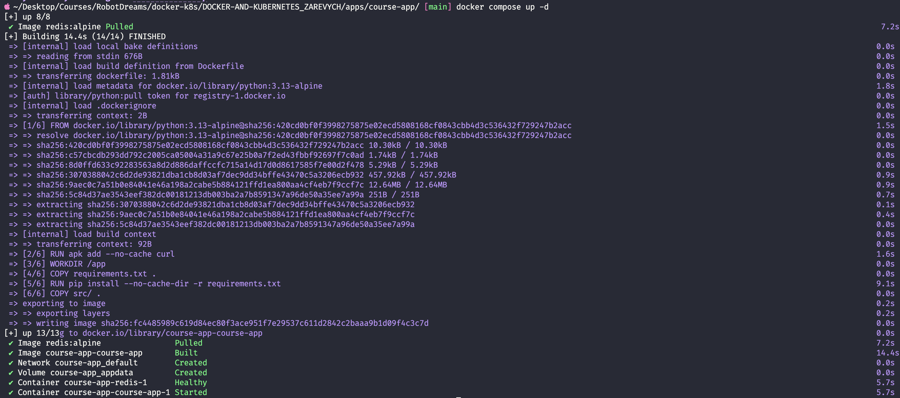
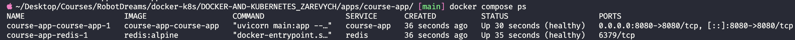
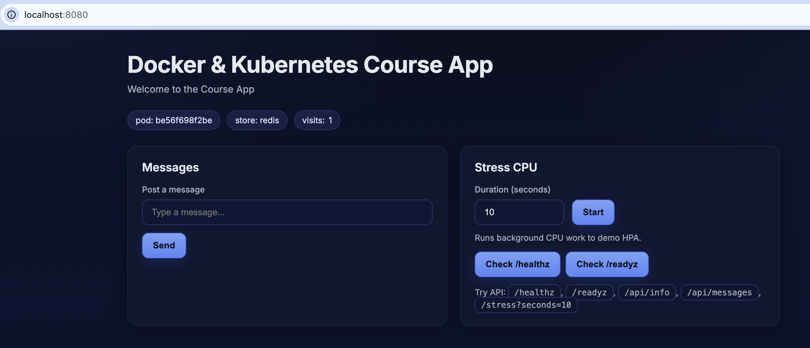
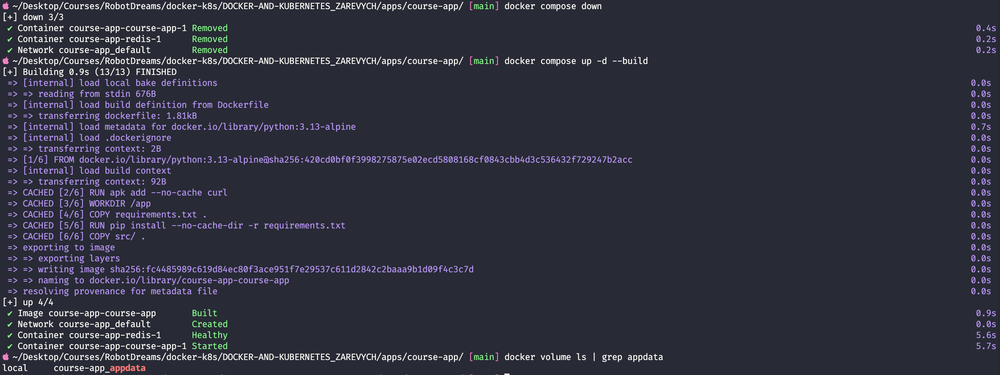
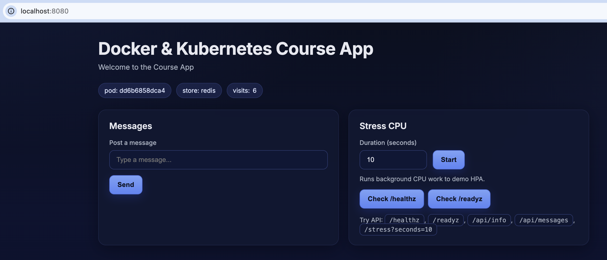
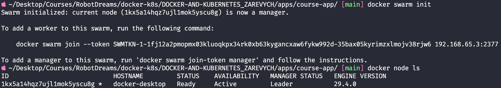
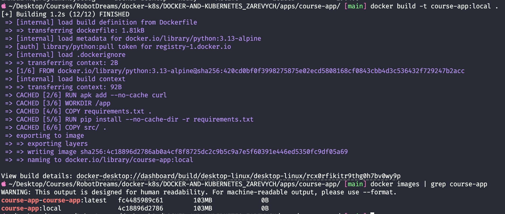
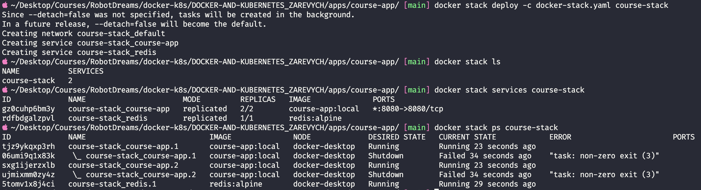
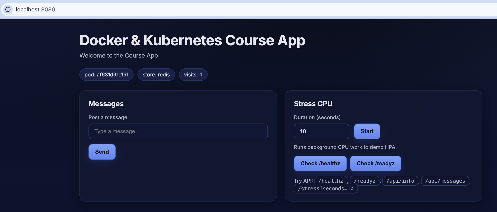
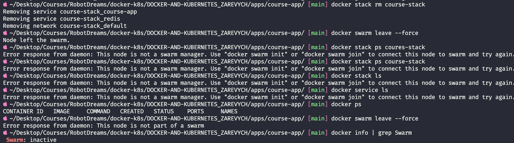

# Домашнє завдання #05 — Docker Compose (частина 2)

## Зміст

- [Середовище](#середовище)
- [Завдання 1 — Healthcheck для сервісів](#завдання-1--healthcheck-для-сервісів)
- [Завдання 2 — Том appdata для персистентності](#завдання-2--том-appdata-для-персистентності)
- [Завдання 3 — Залежності та порядок запуску](#завдання-3--залежності-та-порядок-запуску)
- [Завдання 5 — Docker у Swarm-режимі](#завдання-5--docker-у-swarm-режимі)
- [Завдання 6 — Деплой stack](#завдання-6--деплой-stack)
- [Прибирання кластера](#прибирання-кластера)
- [Висновки](#висновки)

---

## Середовище

| Параметр   | Значення                                |
| ---------- | --------------------------------------- |
| OS         | macOS (Apple Silicon, arm64)            |
| Docker     | Docker Desktop, Engine 29.4.0           |
| Shell      | zsh                                     |
| Застосунок | FastAPI + uvicorn на Python 3.13-alpine |
| Сховище    | Redis (redis:alpine)                    |

---

## Завдання 1 — Healthcheck для сервісів

### Що таке healthcheck

Контейнер може **працювати** (процес запущено), але застосунок всередині ще не готовий приймати запити — наприклад, підключається до БД чи прогріває кеш. Docker сам по собі цього не бачить — для нього "процес живий = все ок".

**Healthcheck** — це періодична перевірка "чи застосунок реально відповідає?". Docker виконує вказану команду всередині контейнера і позначає статус:

- `starting` — щойно стартував, ще перевіряється (протягом `start_period`)
- `healthy` — перевірка пройшла ✅
- `unhealthy` — `retries` фейлів поспіль ❌

> 💡 **Аналогія:** healthcheck — це як перевірка пульсу в лікарні. Людина лежить на ліжку (контейнер запущено), але лікар все одно періодично слухає серце — щоб переконатись що пацієнт живий, а не просто лежить.

### Параметри healthcheck

| Параметр       | Значення | Для чого                                                  |
| -------------- | -------- | --------------------------------------------------------- |
| `test`         | команда  | що виконувати (exit code 0 = healthy, інакше = unhealthy) |
| `interval`     | `10s`    | як часто повторювати перевірку                            |
| `timeout`      | `3s`     | максимальний час відповіді                                |
| `retries`      | `3`      | скільки фейлів поспіль → unhealthy                        |
| `start_period` | `5-10s`  | "пільговий час" на старті — фейли не рахуються            |

### Healthcheck для course-app

Застосунок має ендпоїнт `/healthz` який повертає `{"status":"ok"}`. Для перевірки використовуємо `curl`:

```yaml
healthcheck:
  test: ["CMD", "curl", "-f", "http://localhost:8080/healthz"]
  interval: 10s
  timeout: 3s
  retries: 3
  start_period: 10s
```

`curl -f` повертає ненульовий exit code при HTTP 4xx/5xx — саме те що треба Docker'у.

> ⚠️ **Нюанс про Alpine:** базовий образ `python:3.13-alpine` **не містить curl**! Тому в `Dockerfile` додано рядок `RUN apk add --no-cache curl`. Без цього healthcheck був би вічно `unhealthy`.

### Healthcheck для Redis

Redis — не HTTP-сервіс. Використовуємо вбудовану `redis-cli` з командою `ping`:

```yaml
healthcheck:
  test: ["CMD", "redis-cli", "ping"]
  interval: 10s
  timeout: 3s
  retries: 3
  start_period: 5s
```

Живий Redis відповідає `PONG`, exit code 0. Мертвий/зависаючий — помилка.

### Порівняння команд перевірки

| Команда           | Чи підходить для Redis? | Чому                                          |
| ----------------- | ----------------------- | --------------------------------------------- |
| `redis-cli ping`  | ✅                      | справжня Redis-команда RESP-протоколом        |
| `curl redis:6379` | ❌                      | Redis не HTTP — курл не вміє з ним розмовляти |
| `ping redis`      | ❌                      | ICMP-перевіряє лише мережу, а не сам сервіс   |

### Результат запуску

```bash
docker compose up -d
```



`Container course-app-redis-1 Healthy` ✅ — Redis пройшов healthcheck **до** старту course-app.

```bash
docker compose ps
```



Обидва контейнери мають статус `Up ... (healthy)`.

✅ Healthcheck налаштовано для обох сервісів, перевірки працюють.

---

## Завдання 2 — Том appdata для персистентності

### Чому без тому дані зникають

Кожен контейнер має свою файлову систему, що створюється з образу. Коли контейнер видаляєш (`docker compose down`) — **файлова система знищується разом з усіма даними**.

Redis пише snapshot у `/data/dump.rdb`. Без тому:

```
1. docker compose up     → Redis записав visits=5 у /data/dump.rdb
2. docker compose down   → контейнер видалений → файл знищено
3. docker compose up     → Redis стартує пустий → visits=0  ❌
```

З томом `appdata:/data` дані живуть **окремо від контейнера** — у керованому Docker-ом сховищі.

> 💡 **Аналогія:** Контейнер — це готель. Том — твоя валіза. Коли виселяєшся (`down`), готель дають іншому гостю, але валізу ти забираєш. При новому заселенні приносиш ту саму валізу — всі речі на місці.

### Named volume vs bind mount

| Тип              | Синтаксис       | Коли використовувати                              |
| ---------------- | --------------- | ------------------------------------------------- |
| **Named volume** | `appdata:/data` | БД, постійні дані — Docker керує, шлях прихований |
| **Bind mount**   | `./data:/data`  | розробка, прямий доступ до файлів з хоста         |
| **tmpfs**        | `type: tmpfs`   | тимчасові дані в пам'яті                          |

Для Redis/Postgres — **завжди named volume**.

### Оголошення тому

У compose-файлі том оголошується **двічі**:

```yaml
services:
  redis:
    volumes:
      - appdata:/data # ← використання

volumes: # ← декларація на верхньому рівні
  appdata:
```

Без декларації отримаємо помилку `service "redis" refers to undefined volume appdata`.

### Перевірка персистентності

Перший запуск — відкриваємо `http://localhost:8080`, оновлюємо сторінку кілька разів:



`visits: 1`, `store: redis`, `pod: be56f698f2be` — застосунок пише у Redis.

Робимо кілька refresh-ів до 5, потім:

```bash
docker compose down
docker compose up -d --build
```



На скріншоті видно що новий білд використовує **CACHED** для всіх шарів (Dockerfile не змінився) — тому `up` займає 0.9 секунди замість 14.4с першого разу. Том `course-app_appdata` видно через `docker volume ls | grep appdata`.

Оновлюємо сторінку:



`visits: 6`, `pod: dd6b6858dca4` (інший ID — **контейнер новий**, але лічильник **збережений**).

✅ Том `appdata` зберігає дані між перезапусками контейнера.

### Корисні команди для томів

```bash
docker volume ls                      # всі томи на машині
docker volume ls | grep appdata       # фільтр за іменем
docker volume inspect <name>          # деталі (шлях, драйвер, мітки)
docker compose down -v                # видалити том разом з контейнерами ⚠️
```

---

## Завдання 3 — Залежності та порядок запуску

### Проблема простого `depends_on`

У базовому вигляді:

```yaml
depends_on:
  - redis
```

...Docker запускає Redis перед course-app, але чекає **лише факт запуску процесу**. Redis може ще не приймати з'єднання (завантажує snapshot, ініціалізується), а course-app вже намагається підключитись → `ConnectionRefusedError` → падіння.

### Рішення — `condition: service_healthy`

Розширений синтаксис дозволяє чекати **готовності** сервісу:

```yaml
depends_on:
  redis:
    condition: service_healthy
```

| Умова                            | Що означає                                 |
| -------------------------------- | ------------------------------------------ |
| `service_started`                | чекати запуску процесу (= простий список)  |
| `service_healthy`                | чекати поки healthcheck стане `healthy` ✅ |
| `service_completed_successfully` | чекати поки контейнер завершиться з exit 0 |

Це працює **тільки тому що ми додали healthcheck** (завдання 1). Без healthcheck Docker не знає як оцінити "здоров'я".

### Як виглядає послідовність старту

```
t=0s   docker compose up
       │
t=0s   ├── redis:      контейнер стартує
       │               start_period (5s)
t=5s   │               healthcheck: redis-cli ping → PONG ✅
       │               status: healthy
       │
t=5s   ├── course-app: depends_on виконано → стартує
       │               start_period (10s)
t=15s  │               healthcheck: curl /healthz → 200 OK ✅
       │               status: healthy
       │
t=15s  └── готово до роботи
```

На скріншоті запуску (Image 1) видно саме цю послідовність — `Container course-app-redis-1 Healthy` з'являється **до** `Container course-app-course-app-1 Started`.

✅ Порядок запуску забезпечено через healthcheck-залежність.

---

## Завдання 5 — Docker у Swarm-режимі

### Compose vs Swarm — ключова різниця

|                 | Docker Compose           | Docker Swarm                           |
| --------------- | ------------------------ | -------------------------------------- |
| Скільки машин   | 1 хост                   | багато хостів (кластер)                |
| Реплікація      | `--scale app=3` на хості | `replicas: 3` по всьому кластеру       |
| Self-healing    | ❌ впав — лежить         | ✅ впав — переcтворено автоматично     |
| Rolling updates | ❌                       | ✅ zero-downtime через `update_config` |
| Порядок запуску | через `depends_on`       | через healthcheck + restart_policy     |
| Команда         | `docker compose`         | `docker stack`                         |

> 💡 **Compose — це одноосібний бізнес.** Ти сам пекар, сам касир, усе в одній пекарні. **Swarm — мережа пекарень** з менеджером: якщо одна закрилась, клієнтів перемикає на іншу; замовлення розподіляє по пропускній здатності.

### Архітектура Swarm

Ноди бувають двох ролей:

- **Manager** — "мозок": приймає команди, розподіляє таски, стежить за станом
- **Worker** — "робітник": виконує те що сказав manager

Одна нода може бути **обома одночасно** — саме так робимо локально на Mac.

### Ініціалізація кластера

```bash
docker swarm init
```



Docker:

1. Перевів Mac у Swarm-режим
2. Зробив ноду `docker-desktop` manager-ом (і одночасно worker-ом)
3. Згенерував **join-token** — секрет для підключення інших машин
4. Повернув команду типу `docker swarm join --token SWMTKN-1-... 192.168.65.3:2377`

Перевірка ноди:

```bash
docker node ls
```

| HOSTNAME       | STATUS | AVAILABILITY | MANAGER STATUS |
| -------------- | ------ | ------------ | -------------- |
| docker-desktop | Ready  | Active       | Leader         |

**Leader** — головний серед manager-нод (для відмовостійкості у великих кластерах буває кілька manager-ів з Raft-consensus).

✅ Swarm-режим активовано, кластер з однієї ноди створено.

---

## Завдання 6 — Деплой stack

### Ієрархія абстракцій Swarm

```
Stack:    course-stack                          ← група сервісів (аналог Compose-проєкту)
 ├── Service:  course-stack_course-app          ← декларація "2 репліки образу X"
 │    ├── Task 1  → Container (Running)         ← конкретний слот з контейнером
 │    └── Task 2  → Container (Running)
 ├── Service:  course-stack_redis               ← декларація "1 репліка redis:alpine"
 │    └── Task 1  → Container (Running)
 ├── Network:  course-stack_default             ← overlay-мережа
 └── Volume:   course-stack_appdata             ← named volume
```

| Рівень    | Що це                                 | Команда перегляду               |
| --------- | ------------------------------------- | ------------------------------- |
| Image     | незмінний шаблон                      | `docker images`                 |
| Container | запущений інстанс                     | `docker ps`                     |
| Task      | слот у сервісі (1 task = 1 контейнер) | `docker stack ps <stack>`       |
| Service   | декларація "яким має бути компонент"  | `docker stack services <stack>` |
| Stack     | група пов'язаних сервісів             | `docker stack ls`               |

### Підготовка образу

Swarm **не вміє `build:`** — у розподіленому кластері немає "поточної директорії". Потрібен готовий образ:

```bash
docker build -t course-app:local .
docker images | grep course-app
```



Образ `course-app:local` (103 MB) зібрано. Цікаве: `docker build` показує **CACHED** для всіх шарів — бо щойно білдили через Compose, нічого не змінилось.

> ⚠️ На скріншоті видно **два схожих образи** з однаковим розміром 103 MB:
>
> - `course-app-course-app:latest` — залишок від Compose (він сам префіксує за ім'ям проєкту)
> - `course-app:local` — наш новий тег
>
> За вмістом це одне й те саме (однакові шари), просто два теги.

### Адаптація compose-файлу під Swarm

Створено окремий `docker-stack.yaml`. Ключові відмінності від `docker-compose.yaml`:

| Було (Compose)                    | Стало (Swarm)               | Чому                             |
| --------------------------------- | --------------------------- | -------------------------------- |
| `build: .`                        | `image: course-app:local`   | Swarm не білдить                 |
| `depends_on: redis: condition: …` | прибрано                    | Swarm ігнорує `depends_on`       |
| —                                 | `deploy: replicas: 2`       | реплікація (неможлива у Compose) |
| —                                 | `deploy: restart_policy: …` | self-healing                     |
| —                                 | `deploy: update_config: …`  | rolling updates                  |

Секція `deploy:` для course-app:

```yaml
deploy:
  replicas: 2
  restart_policy:
    condition: on-failure
    delay: 5s
    max_attempts: 3
  update_config:
    parallelism: 1
    delay: 10s
    order: start-first
```

Для Redis — `replicas: 1` (БД не можна масштабувати копіюванням — буде data corruption).

### Запуск stack

```bash
docker stack deploy -c docker-stack.yaml course-stack
```



Вивід:

```
Creating network course-stack_default
Creating service course-stack_course-app
Creating service course-stack_redis
```

Перевірка:

```bash
docker stack ls
docker stack services course-stack
docker stack ps course-stack
```

| NAME                    | REPLICAS | IMAGE            |
| ----------------------- | -------- | ---------------- |
| course-stack_course-app | 2/2      | course-app:local |
| course-stack_redis      | 1/1      | redis:alpine     |

### ⚠️ Цікавий момент — Failed таски

У виводі `docker stack ps` видно **5 рядків** (2 × course-app Running + 2 Failed + 1 redis):

```
course-stack_course-app.1   Running    23 seconds ago
\_ course-stack_course-app.1  Shutdown   Failed 34 seconds ago  "non-zero exit (3)"
course-stack_course-app.2   Running    23 seconds ago
\_ course-stack_course-app.2  Shutdown   Failed 34 seconds ago  "non-zero exit (3)"
course-stack_redis.1        Running    29 seconds ago
```

**Що сталось:** Swarm **ігнорує `depends_on`**. Тому course-app стартував **паралельно** з Redis, не чекаючи його healthy-статусу. Uvicorn спробував підключитись до Redis → ConnectionRefused → exit 3 → task позначений як Failed.

**Як вирішилось:** `restart_policy: on-failure` спрацював — Swarm автоматично створив нові таски, які цього разу підключились успішно (бо Redis вже став healthy).

Символ `\_` означає "попередня спроба цього слоту". Swarm зберігає історію для дебагу.

> 💡 **Це демонстрація self-healing.** У K8s той самий патерн називається `CrashLoopBackOff`. Базова вимога до cloud-native застосунків: **переживати рестарти і відновлюватись автоматично**. У продакшені стійке рішення — retry-логіка в самому коді або init-контейнер, що чекає на Redis.

### Застосунок працює



`visits: 1`, `store: redis`, `pod: af631d91c151` (новий ID — це репліка від Swarm).

✅ Stack задеплоєно, обидва сервіси працюють, застосунок доступний.

---

## Прибирання кластера

Після завершення роботи — прибираємо все щоб повернути Docker у звичайний стан:

```bash
docker stack rm course-stack      # видаляє сервіси, таски, мережу
docker swarm leave --force        # виходить зі Swarm-режиму
docker info | grep Swarm          # перевірка
```



На скріншоті видно:

1. `docker stack rm course-stack` → `Removing service course-stack_course-app`, `Removing service course-stack_redis`, `Removing network course-stack_default`
2. `docker swarm leave --force` → `Node left the swarm`
3. Після цього будь-яка `docker stack/service` команда повертає `Error: This node is not a swarm manager` — логічно, кластеру більше нема
4. `docker ps` повертає пусто — контейнерів нема
5. `docker info | grep Swarm` → **`Swarm: inactive`** ✅

> 💡 **Чому `--force` для `swarm leave`?** Без нього Docker не дасть вийти manager-у (це зламало б кластер, якщо є інші ноди). `--force` каже "я усвідомлюю наслідки".

✅ Swarm вимкнено, всі ресурси прибрані.

---

## Висновки

### Статус завдань

| #   | Завдання                                           | Статус |
| --- | -------------------------------------------------- | ------ |
| 1   | Додати healthcheck для сервісів apps/course-app    | ✅     |
| 2   | Том `appdata` зберігає лічильник між перезапусками | ✅     |
| 3   | Налаштувати залежності/порядок запуску             | ✅     |
| 4   | Запустити Docker у Swarm-режимі                    | ✅     |
| 5   | Задеплоїти stack                                   | ✅     |

### Що нового відносно hw-04

| Фіча                          | hw-04        | hw-05              |
| ----------------------------- | ------------ | ------------------ |
| `build` + `ports` + `env`     | ✅           | ✅                 |
| `depends_on` (простий список) | ✅           | —                  |
| `healthcheck`                 | ❌           | ✅                 |
| `depends_on: service_healthy` | ❌           | ✅                 |
| Том `appdata`                 | `redis_data` | ✅ (перейменовано) |
| Docker Swarm + stack deploy   | ❌           | ✅                 |
| Rolling updates (`deploy:`)   | ❌           | ✅                 |

### Ключові інсайти

- **Healthcheck — фундамент оркестрації.** Без нього `depends_on: service_healthy` неможливе, а Swarm/K8s не знають коли направляти трафік до контейнера.
- **`curl` треба додати в образ.** Alpine-базовий Python не має його з коробки.
- **Том — окрема сутність.** Він переживає контейнер. Без нього БД = пам'ятка на серветці.
- **Swarm ≠ Compose з реплікацією.** Інша модель запуску — `build:` не працює, `depends_on` ігнорується, з'являється декларативне `deploy:`.
- **Self-healing не безкоштовний.** Перший запуск з Failed-тасками — це нормально для Swarm; застосунок має вміти перезапускатись і перепідключатись.

### Корисні команди

```bash
# --- Docker Compose ---
docker compose up -d                     # запустити у фоні
docker compose up -d --build             # перебудувати образи перед запуском
docker compose ps                        # статуси контейнерів (видно health)
docker compose logs -f <service>         # логи конкретного сервісу
docker compose down                      # зупинити і видалити (том залишається)
docker compose down -v                   # видалити разом з томами ⚠️

# --- Томи ---
docker volume ls                         # всі томи
docker volume ls | grep <pattern>        # фільтр за іменем
docker volume inspect <name>             # деталі тому
docker volume rm <name>                  # видалити (контейнери мають бути зупинені)

# --- Образи ---
docker build -t <name>:<tag> .           # зібрати з тегом
docker images                            # список локальних образів
docker images | grep <name>              # фільтр

# --- Docker Swarm ---
docker swarm init                        # ініціалізувати кластер
docker node ls                           # список нод кластера
docker swarm leave --force               # вийти зі Swarm

# --- Stack ---
docker stack deploy -c <file> <name>     # задеплоїти стек
docker stack ls                          # список стеків
docker stack services <name>             # сервіси стеку (REPLICAS)
docker stack ps <name>                   # таски стеку (з історією Failed)
docker stack rm <name>                   # видалити стек

# --- Service (без стеку) ---
docker service ls                        # всі сервіси
docker service ps <name>                 # таски сервісу
docker service update --image <new> <name>  # rolling update

# --- Перевірки ---
docker info | grep Swarm                 # Swarm: active | inactive
docker ps                                # запущені контейнери
docker ps -a                             # всі контейнери (і зупинені)
```
