# Домашнє завдання #06 — Основи Kubernetes

## Зміст

- [Середовище](#середовище)
- [Завдання 0 — Підготовка середовища](#завдання-0--підготовка-середовища)
- [Завдання 1 — Запушити імедж у Docker Hub](#завдання-1--запушити-імедж-у-docker-hub)
- [Завдання 2 — Маніфести Deployment та Service](#завдання-2--маніфести-deployment-та-service)
- [Завдання 3 — Деплой ресурсів у кластер](#завдання-3--деплой-ресурсів-у-кластер)
- [Завдання 4 — Зміна replicas та rollout status](#завдання-4--зміна-replicas-та-rollout-status)
- [Проблеми та рішення](#проблеми-та-рішення)
- [Висновки](#висновки)

---

## Середовище

| Параметр                | Значення                                                 |
| ----------------------- | -------------------------------------------------------- |
| OS                      | macOS (Apple Silicon, arm64)                             |
| Docker                  | Docker Desktop 4.71.0 (engine 29.4.1)                    |
| Kubernetes distribution | **Docker Desktop K8s (kubeadm)** замість Rancher Desktop |
| Kubernetes version      | v1.34.1                                                  |
| kubectl context         | `docker-desktop`                                         |
| Buildx driver           | `docker-container` (для multi-arch)                      |
| Image store             | containerd snapshotter                                   |
| Docker Hub              | `zlarkisz/course-app`                                    |
| Shell                   | zsh                                                      |
| Дата виконання          | 28 квітня 2026                                           |

> ℹ️ **Примітка щодо Rancher Desktop.** У завданні згадано Rancher Desktop, але на машині встановлений Docker Desktop з вбудованим K8s. Функціонально це той самий single-node кластер. Для домашки використано `kubeadm` provisioning (не `kind`), бо він простіший і не вимагає окремого `kind load docker-image` для локальних образів.

---

## Завдання 0 — Підготовка середовища

### Увімкнення Kubernetes у Docker Desktop

У `Settings → Kubernetes`:

- ✅ Enable Kubernetes
- Provisioning method: **Kubeadm**
- Version: v1.34.1

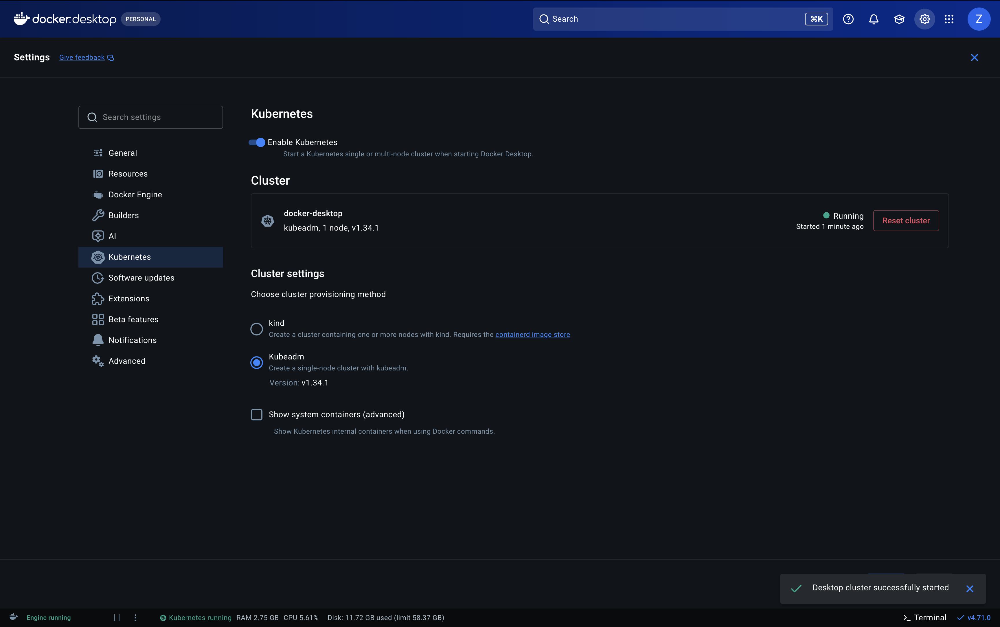

✅ Кластер `docker-desktop` запущений (kubeadm, 1 node).

### Налаштування kubectl context

При першому запуску `kubectl get nodes` отримав помилку:

```
The connection to the server localhost:8080 was refused
```

Причина — у `~/.kube/config` контекст `docker-desktop` був, але **не активний** (`current-context is not set`):

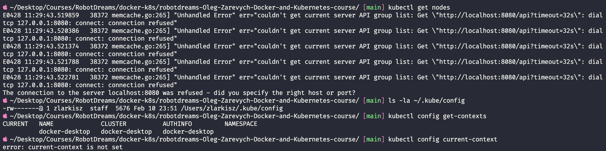

Виправлення:

```bash
kubectl config use-context docker-desktop
```

> 💡 **Чому 8080.** Це дефолтний порт kubectl коли немає активного context'у. Реальний API-server Docker Desktop K8s слухає на `https://kubernetes.docker.internal:6443`.

### Перевірка кластера

```bash
kubectl cluster-info
kubectl get nodes
```

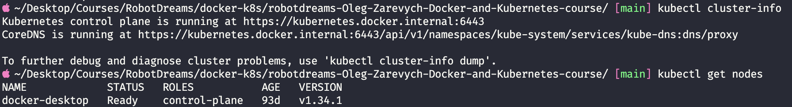

✅ Control plane живий, нода `docker-desktop` у статусі `Ready`, версія `v1.34.1`.

---

## Завдання 1 — Запушити імедж у Docker Hub

### Що відбувається і навіщо

Локальний образ існує тільки в Docker daemon на твоїй машині. Kubernetes-нода (навіть якщо це той самий комп'ютер у Docker Desktop) пулить образ з registry за іменем. Тому пайплайн: `docker build` → `docker push` → у маніфесті вказуємо `image: zlarkisz/course-app:1.0.1` → kubelet сам спулить.

> 💡 **Аналогія:** Локальний Docker — твоя домашня бібліотека. Docker Hub — публічна бібліотека міста. Поки книга вдома — її прочитаєш тільки ти. Здав у міську (`docker push`) — кожен бере за номером (`zlarkisz/course-app:1.0.1`).

### Підготовка buildx для multi-arch

Apple Silicon білдить за замовчуванням `linux/arm64`. Образ потрібен як для arm64, так і для amd64. Multi-arch вимагає окремого buildx-білдера з `docker-container` driver (вбудований `docker` driver не підтримує multi-platform):

```bash
docker buildx create --name multiarch --driver docker-container --use --bootstrap
```

| Прапорець                   | Значення                                                |
| --------------------------- | ------------------------------------------------------- |
| `--name multiarch`          | назва білдера                                           |
| `--driver docker-container` | окремий контейнер з buildkit (підтримує multi-platform) |
| `--use`                     | зробити активним за замовчуванням                       |
| `--bootstrap`               | негайно стартонути buildkit                             |

Додатково — у `Settings → General` Docker Desktop увімкнено **containerd image store**, бо без нього multi-arch образи не зберігаються локально.

### Команда білду

Файли застосунку (`requirements.txt`, `src/`) лежать у репо викладача (`DOCKER-AND-KUBERNETES_ZAREVYCH/apps/course-app/`). Білд робимо звідти, щоб контекст був мінімальним. Наш Dockerfile у `homework-06/Dockerfile` — використовуємо через `-f`:

```bash
cd /Users/zlarkisz/Desktop/Courses/RobotDreams/docker-k8s/DOCKER-AND-KUBERNETES_ZAREVYCH/apps/course-app

docker buildx build \
  --platform linux/amd64,linux/arm64 \
  -f ../../../robotdreams-Oleg-Zarevych-Docker-and-Kubernetes-course/homework-06-Kubernetes-Basics/Dockerfile \
  -t zlarkisz/course-app:1.0.1 \
  --push \
  .
```

| Прапорець                            | Значення                                                 |
| ------------------------------------ | -------------------------------------------------------- |
| `--platform linux/amd64,linux/arm64` | multi-arch білд, дві платформи в одному manifest list    |
| `-f <path>`                          | який Dockerfile використати (наш, з homework-06)         |
| `-t zlarkisz/course-app:1.0.1`       | тег образу                                               |
| `--push`                             | пушити в registry після білду                            |
| `.`                                  | контекст білду — поточна директорія (`apps/course-app/`) |

> 💡 **Чому semver `1.0.1`, а не `latest`.** Тег `latest` — пастка: K8s закешує і не оновить, неясно яка версія в проді. `1.0.1` — patch bump після виправлення PermissionError (див. розділ "Проблеми та рішення").

### Результат

Образ у Docker Hub:

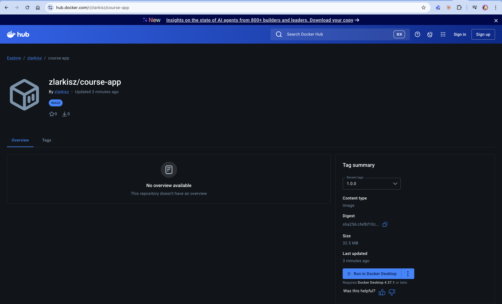

Multi-arch підтверджено через `docker buildx imagetools inspect`:

```bash
docker buildx imagetools inspect zlarkisz/course-app:1.0.1
```

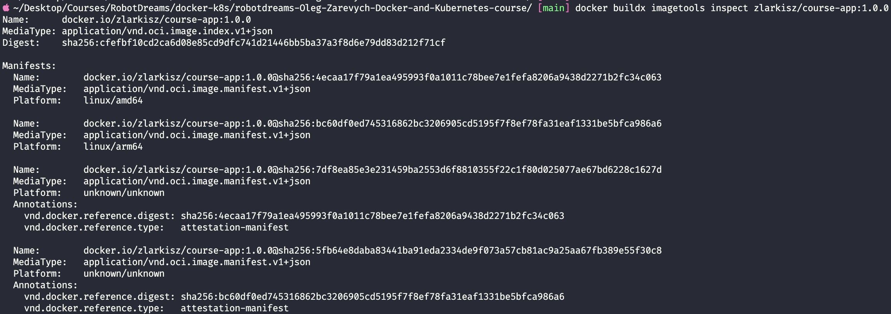

Видно: один тег `1.0.1` містить два маніфести — `linux/amd64` і `linux/arm64`. Розмір ~32.5 MB.

✅ Образ успішно запушено у Docker Hub, multi-arch (amd64 + arm64).

---

## Завдання 2 — Маніфести Deployment та Service

### Структура файлів

```
homework-06-Kubernetes-Basics/
├── Dockerfile
├── README.md
├── k8s/
│   ├── deployment.yaml
│   └── service.yaml
└── screenshots/
```

### Deployment

Керує життєвим циклом подів: підтримує бажану кількість реплік, виконує rolling update без даунтайму, перестворює поди при падінні.

```yaml
apiVersion: apps/v1
kind: Deployment
metadata:
  name: course-app
  labels:
    app: course-app
    component: backend
spec:
  replicas: 5
  selector:
    matchLabels:
      app: course-app
      component: backend
  strategy:
    type: RollingUpdate
    rollingUpdate:
      maxSurge: 1
      maxUnavailable: 0
  template:
    metadata:
      labels:
        app: course-app
        component: backend
        version: "1.0.1"
    spec:
      containers:
        - name: course-app
          image: zlarkisz/course-app:1.0.1
          imagePullPolicy: IfNotPresent
          ports:
            - name: http
              containerPort: 8080
              protocol: TCP
          resources:
            requests:
              memory: "32Mi"
              cpu: "50m"
            limits:
              memory: "128Mi"
              cpu: "250m"
          env:
            - name: APP_STORE
              value: "sqlite"
            - name: APP_MESSAGE
              value: "Course App in Kubernetes"
```

**Ключові моменти:**

| Поле                             | Чому саме так                                                                         |
| -------------------------------- | ------------------------------------------------------------------------------------- |
| `apiVersion: apps/v1`            | Стабільна версія API групи `apps` (Deployment живе тут)                               |
| `replicas: 5`                    | Початково було 2, бампнуто до 5 у завданні 4                                          |
| `selector.matchLabels`           | Має збігатися з `template.metadata.labels`, інакше Deployment не "побачить" свої поди |
| `strategy: RollingUpdate`        | Поступове оновлення без даунтайму                                                     |
| `maxSurge: 1, maxUnavailable: 0` | Zero-downtime: жоден старий под не вмирає до того як новий стане Ready                |
| `imagePullPolicy: IfNotPresent`  | Не пулити повторно якщо образ закешований (дефолт для тегованих образів)              |
| `containerPort: 8080`            | Документує порт; uvicorn слухає тут (`--port 8080`)                                   |
| `name: http`                     | Іменований порт — Service посилається через `targetPort: http`                        |
| `resources`                      | Requests/limits мінімальні (32Mi/50m → 128Mi/250m) щоб не жерти локальну машину       |
| `env`                            | `APP_MESSAGE` видно прямо на сторінці — підтвердження що змінні передаються           |

### Service (NodePort)

Виставляє поди назовні. ClusterIP стабільна (не залежить від ефемерних IP подів), NodePort відкриває порт на ноді щоб трафік ззовні дістав застосунок.

```yaml
apiVersion: v1
kind: Service
metadata:
  name: course-app
  labels:
    app: course-app
    component: backend
spec:
  type: NodePort
  selector:
    app: course-app
    component: backend
  ports:
    - name: http
      port: 80
      targetPort: http
      nodePort: 30080
      protocol: TCP
```

**Три порти у Service** — один з найзаплутаніших моментів K8s, варто розкласти:

| Порт               | Де живе               | Хто звертається            | Хто слухає         |
| ------------------ | --------------------- | -------------------------- | ------------------ |
| `port: 80`         | у Service (ClusterIP) | інші поди в кластері       | Service            |
| `targetPort: http` | у поді                | Service (внутрішньо)       | контейнер на 8080  |
| `nodePort: 30080`  | на ноді               | зовнішні клієнти (браузер) | kube-proxy на ноді |

> 💡 **Аналогія.** `nodePort` — ворота на вулиці. `port` — двері в офіс. `targetPort` — стіл працівника.

> 💡 **Чому `targetPort: http`, а не `8080`.** Якщо колись зміниться порт застосунку (8080 → 3000), править треба в одному місці — `containerPort`. Service підхопить через ім'я.

✅ Маніфести Deployment та Service NodePort написано та провалідовано через `kubectl apply --dry-run=server`.

---

## Завдання 3 — Деплой ресурсів у кластер

### Apply маніфестів

```bash
cd homework-06-Kubernetes-Basics
kubectl apply -f k8s/ --dry-run=server   # валідація
kubectl apply -f k8s/                    # реальний apply
kubectl get pods -w                      # спостереження
```

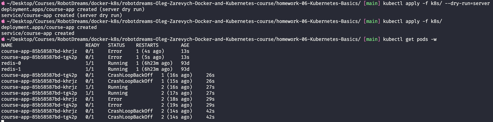

На скріні видно три речі:

1. `dry-run=server` пройшов: `deployment.apps/course-app created (server dry run)`
2. Реальний apply: `deployment.apps/course-app created`, `service/course-app created`
3. Поди застосунку впали в `CrashLoopBackOff` — див. розділ [Проблеми та рішення](#проблеми-та-рішення)

> ℹ️ Поди `redis-0` і `redis-1` (AGE 93d) — залишки від попередніх експериментів зі StatefulSet, не стосуються цієї домашки.

### Перевірка у браузері після фіксу

Після виправлення прав на `/app/data` і ребілду на `1.0.1`, поди стартонули. Застосунок доступний на `http://localhost:30080`:

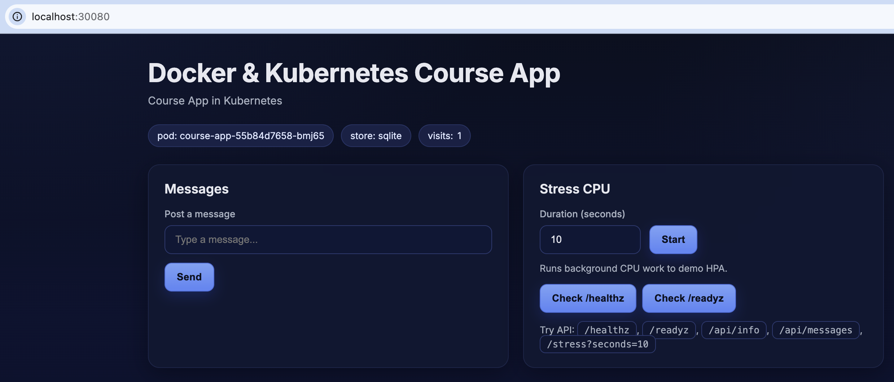

Видно:

- Заголовок "Docker & Kubernetes Course App"
- Підзаголовок **"Course App in Kubernetes"** — наш `APP_MESSAGE` із env
- Бейдж `pod: course-app-55b84d7658-bmj65` — ім'я конкретного пода що відповів
- Бейдж `store: sqlite` — підтвердження `APP_STORE` env
- Бейдж `visits: 1` — лічильник пише у SQLite (файлова система працює)

> 💡 **Цікаве спостереження.** При оновленні сторінки в браузері ім'я пода **не змінюється** — завжди той самий. Це не зламане балансування, а наслідок HTTP/1.1 keep-alive: браузер тримає TCP-з'єднання відкритим, всі запити йдуть через нього на той самий под. K8s балансує на рівні TCP-з'єднань (L4), не HTTP-запитів (L7). Щоб побачити чергування — треба нові з'єднання, наприклад через `curl`:
>
> ```bash
> for i in {1..6}; do curl -s http://localhost:30080/api/info | grep -o '"hostname":"[^"]*"'; done
> ```

✅ Ресурси задеплоєно у кластер, застосунок доступний на `http://localhost:30080`.

---

## Завдання 4 — Зміна replicas та rollout status

### Зміна у файлі

У `k8s/deployment.yaml` замінено `replicas: 2` на `replicas: 5`.

### Apply і rollout status

```bash
kubectl apply -f k8s/
kubectl rollout status deployment/course-app
kubectl get pods
kubectl get deployment course-app
```

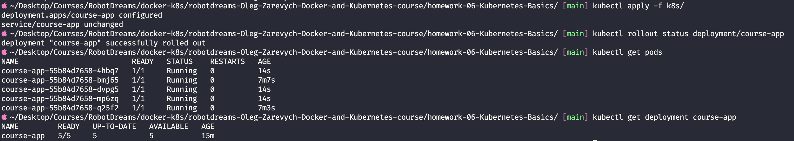

Вивід:

```
deployment.apps/course-app configured
service/course-app unchanged

deployment "course-app" successfully rolled out

NAME                          READY   STATUS    RESTARTS   AGE
course-app-55b84d7658-4hbq7   1/1     Running   0          14s     ← новий
course-app-55b84d7658-bmj65   1/1     Running   0          7m7s    ← старий
course-app-55b84d7658-dvpg5   1/1     Running   0          14s     ← новий
course-app-55b84d7658-mp6zq   1/1     Running   0          14s     ← новий
course-app-55b84d7658-q25f2   1/1     Running   0          7m3s    ← старий

NAME         READY   UP-TO-DATE   AVAILABLE   AGE
course-app   5/5     5            5           15m
```

Видно ключове: два поди живуть **7 хвилин**, три — **14 секунд**. K8s **не перестворював всіх**, а тільки додав 3 нових. Це і є rolling update — мінімум змін для досягнення нового бажаного стану.

### Повна картина

```bash
kubectl get all
```

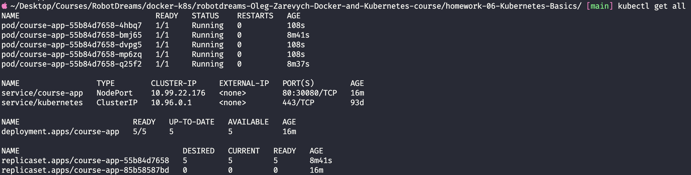

Видно:

- 5 подів `course-app` — всі `Running`
- `service/course-app NodePort 80:30080/TCP`
- `deployment.apps/course-app 5/5`
- **Два ReplicaSet'и** — `55b84d7658` (5 podів живі) і `85b58587bd` (0 podів, історія)

> 💡 **Чому два ReplicaSet'и.** Перший був створений з image `1.0.0` (зламаний), другий — з `1.0.1` (робочий). K8s зберігає старі ReplicaSet'и для можливості rollback'у через `kubectl rollout undo` (за замовчуванням 10 ревізій).

### Rollout history

```bash
kubectl rollout history deployment/course-app
```

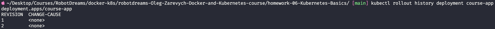

Дві ревізії — два деплої:

- REVISION 1 — початковий (image `1.0.0`)
- REVISION 2 — після ребілду (image `1.0.1`)

### Деталі Deployment

```bash
kubectl describe deployment course-app | head -40
```

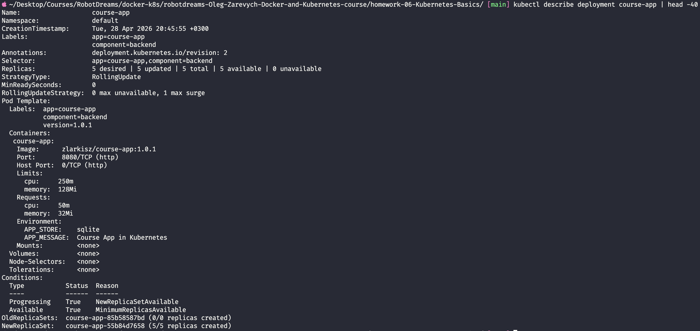

На скріні видно як K8s бачить наш Deployment "зсередини":

- `Replicas: 5 desired | 5 updated | 5 total | 5 available | 0 unavailable`
- `StrategyType: RollingUpdate`
- `RollingUpdateStrategy: 0 max unavailable, 1 max surge`
- `Image: zlarkisz/course-app:1.0.1`
- `Limits: cpu 250m, memory 128Mi` / `Requests: cpu 50m, memory 32Mi`
- `Environment: APP_STORE=sqlite, APP_MESSAGE=Course App in Kubernetes`
- `OldReplicaSets: course-app-85b58587bd (0/0 replicas)` — стара версія
- `NewReplicaSet: course-app-55b84d7658 (5/5 replicas)` — поточна

✅ Replicas збільшено з 2 до 5, rolling update пройшов без даунтайму, всі 5 подів `Running`.

---

## Проблеми та рішення

### Проблема 1: `Multi-platform build is not supported for the docker driver`

**Причина:** Дефолтний buildx-driver у Docker Desktop (`docker`) не підтримує multi-platform білди. Він використовує buildkit вбудований у dockerd, який працює тільки з однією платформою за раз.

**Рішення:** Створити окремий builder з `docker-container` driver — він запускає buildkit в окремому контейнері з повною підтримкою multi-arch:

```bash
docker buildx create --name multiarch --driver docker-container --use --bootstrap
```

Додатково — увімкнено **containerd image store** у Docker Desktop (Settings → General), бо без нього multi-arch образи не зберігаються локально.

### Проблема 2: kubectl `current-context is not set`

**Симптоми:** `kubectl get nodes` повертав помилку про `localhost:8080 connection refused`, хоча K8s був активний.

**Причина:** У `~/.kube/config` контекст `docker-desktop` був, але не активований. Файл існував з раніших налаштувань (10 лютого), і Docker Desktop не перезаписав глобальний `current-context`.

**Рішення:**

```bash
kubectl config use-context docker-desktop
```

### Проблема 3: `PermissionError [Errno 13] 'data'` — CrashLoopBackOff при старті

**Симптоми:** Поди стартонули, але одразу впали в `CrashLoopBackOff` з 3 рестартами за 70 секунд.

**Діагностика:**

```bash
kubectl logs course-app-85b58587bd-khrjz
```

```
File "/app/main.py", line 66, in init
    os.makedirs(dirpath, exist_ok=True)
PermissionError: [Errno 13] Permission denied: 'data'
ERROR: Application startup failed. Exiting.
```

**Причина:** У Dockerfile додано non-root юзера (`USER appuser`), але `/app` належить `root:root`. Застосунок при старті намагається створити `data/data.sql` (SQLite store) — і отримує EACCES.

**Рішення:** У Dockerfile додано рядок який створює `/app/data` і дає права appuser **до** перемикання `USER appuser`:

```dockerfile
RUN mkdir -p /app/data && chown appuser:appuser /app/data
```

Точкове видавання прав (тільки на `data/`, не на весь `/app`) — principle of least privilege. Якщо застосунок зламають, атакуючий зможе писати тільки в `data/`, а не переписати код у `/app/main.py`.

**Бамп версії:** Після фіксу зробив patch bump `1.0.0 → 1.0.1` за semver. Чому не перепушив `1.0.0`: K8s з `imagePullPolicy: IfNotPresent` не помітив би зміни (закешував би старий image). Новий тег = чистий потік оновлення.

---

## Висновки

### Статус завдань

| #   | Завдання                                   | Статус                                                   |
| --- | ------------------------------------------ | -------------------------------------------------------- |
| 1   | Запушити image для course-app у Docker Hub | ✅ multi-arch (amd64+arm64), `zlarkisz/course-app:1.0.1` |
| 2   | Маніфести Deployment + Service NodePort    | ✅ `k8s/deployment.yaml`, `k8s/service.yaml`             |
| 3   | Задеплоїти у кластер                       | ✅ `localhost:30080` працює                              |
| 4   | Змінити replicas, спостерігати rollout     | ✅ 2 → 5, "successfully rolled out"                      |

### Корисні команди

```bash
# === Образ і registry ===
docker buildx create --name multiarch --driver docker-container --use --bootstrap
docker buildx build --platform linux/amd64,linux/arm64 -t <user>/<image>:<tag> --push .
docker buildx imagetools inspect <user>/<image>:<tag>     # подивитись multi-arch манifest

# === Кластер ===
kubectl config current-context                            # який context активний
kubectl config use-context <name>                         # переключити
kubectl cluster-info                                       # API server, DNS
kubectl get nodes                                          # ноди кластера

# === Apply / Delete ===
kubectl apply -f k8s/                                      # застосувати всі yaml у папці
kubectl apply -f k8s/ --dry-run=server                     # валідація без змін
kubectl delete -f k8s/                                     # видалити все що описано

# === Стан ===
kubectl get all                                            # повна картина namespace
kubectl get pods -w                                        # watch у реальному часі
kubectl get pods -l app=course-app                         # фільтр за лейблом
kubectl get pods -o wide                                   # з IP і нодою
kubectl describe pod <pod-name>                            # детальна інформація + Events
kubectl describe deployment <name>                         # деталі Deployment
kubectl logs <pod-name>                                    # логи застосунку
kubectl logs <pod-name> --previous                         # логи попередньої спроби (після рестарту)
kubectl logs -f <pod-name>                                 # стрім логів

# === Rollout ===
kubectl rollout status deployment/<name>                   # стан rollout у real-time
kubectl rollout history deployment/<name>                  # історія revisions
kubectl rollout undo deployment/<name>                     # відкот на попередню revision
kubectl rollout restart deployment/<name>                  # форсовий рестарт всіх подів

# === Scaling ===
kubectl scale deployment <name> --replicas=N               # imperative scale (без зміни yaml)

# === Debugging ===
kubectl exec -it <pod-name> -- sh                          # shell всередині пода
kubectl port-forward pod/<pod-name> 8080:8080              # форвард порту локально
```

### Що засвоєно

- **Маніфести як declarative state** — описуєш бажаний стан, K8s сам розбирається як його досягти
- **Контролер-патерн** — Deployment керує ReplicaSet'ом, ReplicaSet керує подами
- **Лейбли — основа K8s** — selector'и, фільтрація, ідентифікація через теги, не імена/ID
- **NodePort як простий зовнішній доступ** — порт на ноді → kube-proxy → балансовка між подами
- **Rolling update без даунтайму** — `maxSurge`/`maxUnavailable` контролюють поведінку
- **`imagePullPolicy: IfNotPresent`** і кешування образів — тегування важливе, `:latest` — пастка
- **Принципи безпеки в Docker** — non-root user, точкові права, principle of least privilege
- **Buildx multi-arch** — `docker-container` driver + containerd image store
