# Домашнє завдання #08 — Service та Ingress у Kubernetes

Мета: налаштувати правильну маршрутизацію зовнішнього трафіку до застосунку в Kubernetes
та забезпечити стабільність сервісу при масштабуванні — через перехід на ClusterIP,
health checks, Ingress з доменним ім'ям, перевірку Zero Downtime та HTTPS.

## Зміст

- [Середовище](#середовище)
- [Структура файлів](#структура-файлів)
- [Точка відліку — базова конфігурація](#точка-відліку--базова-конфігурація)
- [Завдання 1 — Service: NodePort → ClusterIP](#завдання-1--service-nodeport--clusterip)
- [Завдання 2 — Health Checks (liveness + readiness)](#завдання-2--health-checks-liveness--readiness)
- [Завдання 3 — Ingress з доменним ім'ям](#завдання-3--ingress-з-доменним-імям)
- [Завдання 4 — Zero Downtime тест](#завдання-4--zero-downtime-тест)
- [Завдання 5 — HTTPS через self-signed сертифікат](#завдання-5--https-через-self-signed-сертифікат)
- [Висновки](#висновки)

---

## Середовище

| Параметр           | Значення                                |
| ------------------ | --------------------------------------- |
| OS                 | macOS (Apple Silicon, arm64)            |
| Kubernetes         | Docker Desktop Kubernetes               |
| Нода               | `docker-desktop` (одна, Linux-VM)       |
| kubectl            | вбудований у Docker Desktop             |
| Ingress Controller | ingress-nginx `controller-v1.11.3`      |
| Namespace          | `homework-08` (окремий, ізольований)    |
| Образ застосунку   | `nginx:1.27-alpine`                     |
| Домен              | `course-app.local` (через `/etc/hosts`) |
| Shell              | zsh                                     |
| Дата виконання     | 14 травня 2026                          |

---

## Структура файлів

```
homework-08-Services-and-Ingress-in-Kubernetes/
├── 01-base.yaml                   # Namespace + Deployment + Service NodePort
├── 02-service-clusterip.yaml      # Service: NodePort → ClusterIP
├── 03-deployment-with-probes.yaml # Deployment + liveness/readiness probes
├── 04-ingress.yaml                # Ingress (HTTP) для course-app.local
├── 05-deployment-zerodowntime.yaml# Deployment для Zero Downtime тесту
├── 06-ingress-tls.yaml            # Ingress з HTTPS (TLS termination)
├── .gitignore                     # ігнорує tls/ — приватний ключ не в git
├── README.md
├── screenshots/
└── tls/                           # сертифікати (НЕ в git) — генеруються локально
```

> Файли пронумеровані за порядком кроків. Кожен `kubectl apply` ідемпотентний —
> повторне застосування оновлює наявний ресурс, а не створює дубль.

---

## Точка відліку — базова конфігурація

Перед основними завданнями створюємо стартову інфраструктуру в окремому namespace `homework-08`:

- **Namespace** `homework-08` — ізольоване "місце" в кластері;
- **Deployment** `nginx-app` — 3 репліки nginx;
- **Service** `nginx-app` типу **NodePort** (порт `30080`) — його далі переводитимемо на ClusterIP.

> 💡 **Чому окремий namespace?** Це best practice: усе ізольовано від інших домашок
> і системних компонентів, легко прибрати одним `kubectl delete ns homework-08`,
> не конфліктують імена ресурсів.

### Розбір трьох "портів" у Service

Місце, де часто плутаються:

| Поле         | Що це                              | Хто це бачить                     |
| ------------ | ---------------------------------- | --------------------------------- |
| `port: 80`   | порт самого Service (ClusterIP:80) | поди в кластері: `curl nginx-app` |
| `targetPort` | порт пода, на який Service шле     | сам Service (внутрішня дорога)    |
| `nodePort`   | порт на хост-машині                | ти зовні: `curl localhost:30080`  |

### Команди

```bash
kubectl apply -f 01-base.yaml
kubectl get pods -n homework-08
kubectl get svc -n homework-08
curl http://localhost:30080
```

### Скріншот

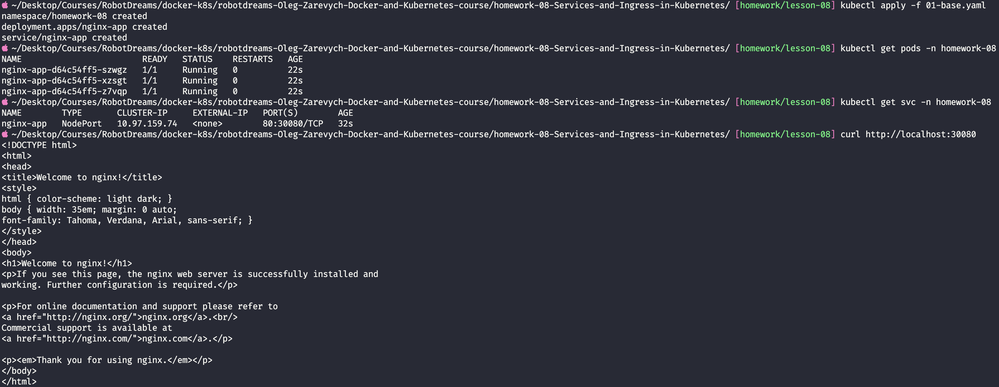

✅ **Результат:** Namespace, Deployment з 3 реплік nginx і Service NodePort створені.
3 поди в стані `Running 1/1`. `curl localhost:30080` повертає сторінку
**"Welcome to nginx!"** — трафік ходить ззовні через NodePort.

---

## Завдання 1 — Service: NodePort → ClusterIP

### Що це таке

Тип Service визначає, **звідки** до нього є доступ. Внутрішня механіка (балансування подів)
у всіх типів однакова — відрізняється лише "вхід ззовні".

| Тип              | Звідки доступний                  | Коли використовувати                           |
| ---------------- | --------------------------------- | ---------------------------------------------- |
| **ClusterIP**    | тільки всередині кластера         | між-сервісна комунікація, робота через Ingress |
| **NodePort**     | ззовні через `<нода>:30000-32767` | локальна розробка, дебаг                       |
| **LoadBalancer** | ззовні через хмарний LB           | прод-сервіс у хмарі без Ingress                |

> 💡 **Аналогія:** NodePort — це чорний хід з номерком на дверях (`30080`), яким
> користуються лише свої. Коли з'явиться Ingress (Завдання 3) — він стане
> "парадним входом", а паралельний NodePort — зайвою точкою входу.

### Що змінюється

У файлі `02-service-clusterip.yaml` змінено `type: NodePort` → `type: ClusterIP`
і видалено рядок `nodePort: 30080`. Решта (selector, port, targetPort) — без змін.
Deployment не чіпається.

### Команди

```bash
# стан ДО — тип NodePort
kubectl get svc -n homework-08

# застосувати зміну
kubectl apply -f 02-service-clusterip.yaml

# стан ПІСЛЯ — тип ClusterIP
kubectl get svc -n homework-08

# 1. ззовні більше НЕ пускає (це очікувано)
curl http://localhost:30080

# 2. зсередини кластера працює — тимчасовий под з curl
kubectl run tmp-curl --rm -it --restart=Never \
  -n homework-08 --image=curlimages/curl:8.10.1 \
  -- curl -s http://nginx-app

# 3. Service знає свої поди
kubectl get endpoints nginx-app -n homework-08
```

### Скріншоти

**Стан ДО** — Service типу `NodePort`, порт `80:30080/TCP`:

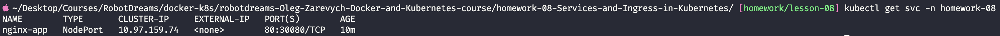

**Стан ПІСЛЯ** — `apply` вивів `service/nginx-app configured`, тип став `ClusterIP`,
порт просто `80/TCP`. Важливо: `CLUSTER-IP` (`10.97.159.74`) **не змінилася** —
Service оновлено, а не перестворено:

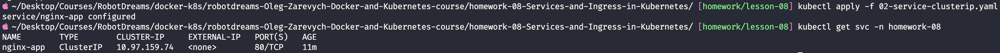

**Три перевірки** — `curl localhost:30080` тепер `Couldn't connect` (чорний хід закрито);
тимчасовий под `tmp-curl` зсередини кластера отримує HTML nginx за DNS-іменем `nginx-app`;
`get endpoints` показує 3 IP подів:

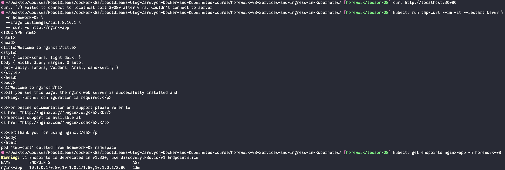

✅ **Результат:** Service переведено на `ClusterIP`. Ззовні через `:30080` доступу більше
немає — це підтверджує, що "чорний хід" закрито. Зсередини кластера Service відповідає
за DNS-іменем `nginx-app` (Service Discovery через CoreDNS). `Endpoints` містить
IP усіх 3 подів — Service знайшов їх за `selector: app=nginx-app`.

---

## Завдання 2 — Health Checks (liveness + readiness)

### Що це таке

Kubernetes не може покладатися лише на факт "процес запущений" — процес може зависнути
або ще не бути готовим. Для цього є дві проби:

| Probe              | Питання                        | Що робить k8s при фейлі                  | Контейнер живий? |
| ------------------ | ------------------------------ | ---------------------------------------- | ---------------- |
| **livenessProbe**  | "Под живий чи завис?"          | **перезапускає** контейнер               | ні, рестарт      |
| **readinessProbe** | "Под готовий приймати трафік?" | **прибирає** IP пода зі списку Endpoints | так, працює      |

> 💡 **Чому це різні речі:** якщо повісити однакову важку перевірку на обидві проби,
> то при тимчасовому перевантаженні readiness прибере под з балансування (правильно),
> але liveness одночасно вб'є контейнер (неправильно) — і так каскадно по всіх репліках.
> Тому liveness має перевіряти лише факт життя, readiness — готовність до роботи.

### Параметри проб

| Параметр              | Значення | Що означає                             |
| --------------------- | -------- | -------------------------------------- |
| `initialDelaySeconds` | 10 / 3   | скільки чекати перед першою перевіркою |
| `periodSeconds`       | 10 / 5   | як часто перевіряти                    |
| `timeoutSeconds`      | 2        | скільки чекати відповіді               |
| `failureThreshold`    | 3        | скільки фейлів підряд = "проблема"     |
| `successThreshold`    | 1        | скільки успіхів підряд = "оклемався"   |

> readiness налаштована частіше за liveness (`period 5` проти `10`): реакція readiness
> дешева (не впливає на трафік напряму), тому може бути оперативнішою; liveness
> "терплячіша", бо зайвий рестарт — дорога операція.

### Команди

```bash
kubectl apply -f 03-deployment-with-probes.yaml
kubectl rollout status deployment/nginx-app -n homework-08
kubectl describe pod -n homework-08 -l app=nginx-app | grep -A 3 "Liveness\|Readiness"
kubectl get pods -n homework-08
```

### Скріншот

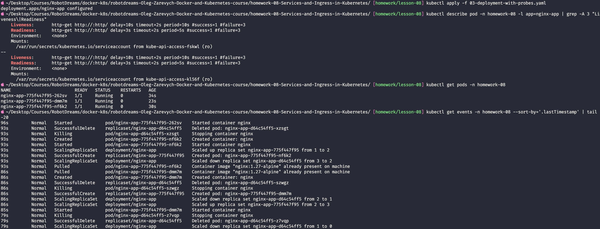

✅ **Результат:** до контейнера додано `livenessProbe` і `readinessProbe` (видно в
`describe pod`). Зміна шаблону пода запустила **rolling update** — у `kubectl get events`
видно, як k8s по черзі масштабував новий ReplicaSet вгору, а старий — вниз, ніколи не
залишаючи кластер без живих реплік. Усі 3 поди — `Running 1/1`, де `1/1` тепер означає
"контейнер запущений **і** readiness probe пройшла".

---

## Завдання 3 — Ingress з доменним ім'ям

### Що це таке

**Ingress Controller** і **Ingress-ресурс** — різні речі:

|          | Ingress-ресурс                  | Ingress Controller             |
| -------- | ------------------------------- | ------------------------------ |
| Що це    | YAML-правило (запис у кластері) | реальний под, що працює        |
| Роль     | описує "host → Service"         | читає правила і **виконує** їх |
| Аналогія | інструкція на стіні рецепції    | сама секретарка                |

Docker Desktop постачає кластер **без** Ingress Controller — його треба встановити окремо.

### Крок 1 — встановлення Ingress Controller

```bash
kubectl apply -f https://raw.githubusercontent.com/kubernetes/ingress-nginx/controller-v1.11.3/deploy/static/provider/cloud/deploy.yaml

kubectl wait --namespace ingress-nginx \
  --for=condition=ready pod \
  --selector=app.kubernetes.io/component=controller --timeout=120s

kubectl get pods -n ingress-nginx
kubectl get svc -n ingress-nginx
```

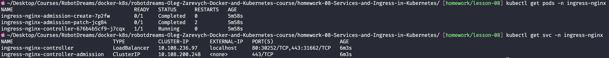

Под `ingress-nginx-controller` у стані `Running 1/1`. Його Service типу `LoadBalancer`
має `EXTERNAL-IP: localhost` — Docker Desktop "вдає" хмарний LoadBalancer і прокидає
порти `80/443` на `localhost`.

### Крок 2 — `/etc/hosts`

`course-app.local` — вигаданий локальний домен, його немає в DNS. Щоб комп'ютер знав,
куди він веде, додаємо запис у `/etc/hosts` (системний файл — потрібен `sudo`):

```bash
echo "127.0.0.1 course-app.local" | sudo tee -a /etc/hosts
```

> 💡 **Аналогія:** `/etc/hosts` — особистий записник контактів, який ОС перевіряє
> **перед** походом у "загальну телефонну книгу" (DNS).

### Крок 3 — Ingress-ресурс

Файл `04-ingress.yaml` описує правило маршрутизації:

| Поле               | Значення           | Сенс                                |
| ------------------ | ------------------ | ----------------------------------- |
| `ingressClassName` | `nginx`            | який Controller обробляє це правило |
| `rules[].host`     | `course-app.local` | для якого домену діє правило        |
| `paths[].pathType` | `Prefix`           | `/` з Prefix = усі шляхи            |
| `backend.service`  | `nginx-app:80`     | у який Service (і порт) відправляти |

```bash
kubectl apply -f 04-ingress.yaml
kubectl get ingress -n homework-08
kubectl describe ingress nginx-app -n homework-08
curl http://course-app.local
```

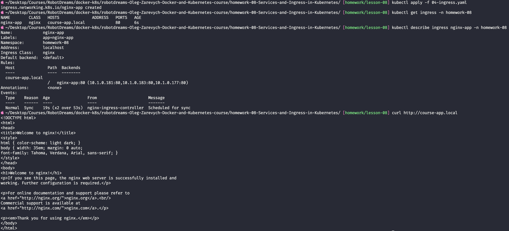

`describe ingress` показує весь маршрут одним рядком:
`course-app.local / → nginx-app:80 (10.1.0.181:80, 10.1.0.183:80, 10.1.0.177:80)` —
домен, шлях, Service і реальні IP подів.

### Перевірка в браузері

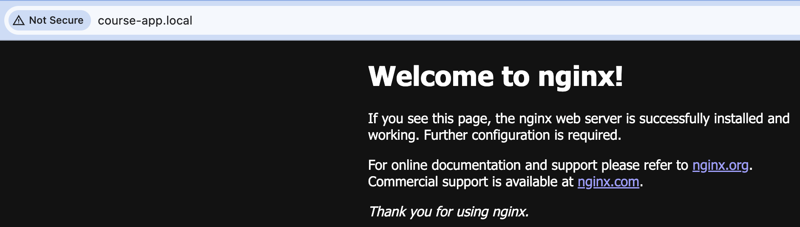

✅ **Результат:** встановлено Ingress Controller, прописано `course-app.local` у
`/etc/hosts`, створено Ingress-ресурс з правилом маршрутизації. Застосунок доступний
за людським доменним ім'ям `course-app.local` і через `curl`, і в браузері —
замість `localhost:30080`.

> ℹ️ Запит на неіснуючий шлях (напр. `course-app.local/gachi`) повертає `404 nginx/1.27.5` —
> це **не помилка маршрутизації**: `Prefix` пропустив запит до пода, а сам nginx не знайшов
> такого файлу і чесно віддав свою 404. Тобто весь ланцюг Ingress → Service → Pod відпрацював.

---

## Завдання 4 — Zero Downtime тест

### Що перевіряємо

Імітуємо ситуацію: один под став "не готовим" (failed readiness check), але **продовжує
працювати**. Треба довести через `kubectl`, що IP цього пода зникає зі списку Endpoints,
а трафік перенаправляється на інші репліки без збоїв для користувача.

### Як це влаштовано

Файл `05-deployment-zerodowntime.yaml` побудований так, щоб readiness можна було
"зламати" незалежно від liveness:

| Probe         | Перевіряє                                    | Чи ламаємо у тесті   |
| ------------- | -------------------------------------------- | -------------------- |
| **liveness**  | `httpGet /` (nginx живий)                    | ні                   |
| **readiness** | `exec: test -f /flag/ready` (файл-прапорець) | так — видаляємо файл |

Файл-прапорець `/flag/ready` лежить у `emptyDir` (записувана тимчасова тека пода) і
створюється хуком `postStart` при старті. Видалення файлу → readiness `exec` повертає
exit 1 → под `0/1`. При цьому liveness (`httpGet /`) досі `200` → контейнер **не**
перезапускається.

### Команди

```bash
# застосувати
kubectl apply -f 05-deployment-zerodowntime.yaml
kubectl rollout status deployment/nginx-app -n homework-08
kubectl get pods -n homework-08 -o wide

# стан ДО — 3 IP в Endpoints
kubectl get endpoints nginx-app -n homework-08

# в окремому вікні — монітор трафіку (має сипати безперервні 200)
while true; do curl -s -o /dev/null -w "%{http_code} " http://course-app.local/; sleep 1; done

# зламати readiness одного пода
POD=nginx-app-79bbb65f4f-6pn9k
kubectl exec -n homework-08 $POD -- rm /flag/ready

# спостерігати: под переходить у 0/1, Endpoints скорочується до 2 IP
kubectl get pods -n homework-08 -w
kubectl get endpoints nginx-app -n homework-08

# полагодити — повернути файл
kubectl exec -n homework-08 $POD -- touch /flag/ready
kubectl get endpoints nginx-app -n homework-08
```

### Скріншоти

**Деплой Zero Downtime-версії** — 3 поди `Running 1/1`, IP `10.1.0.193/194/195`:

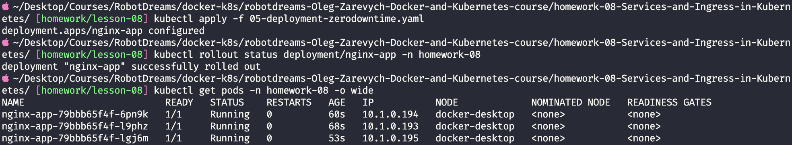

**Под зникає з Endpoints** — після `rm /flag/ready` под `6pn9k` переходить у
`0/1 Running` (`STATUS: Running`, `RESTARTS: 0` — живий, не перезапущений), а
`get endpoints` показує вже **2 IP замість 3** — `10.1.0.194` зник:

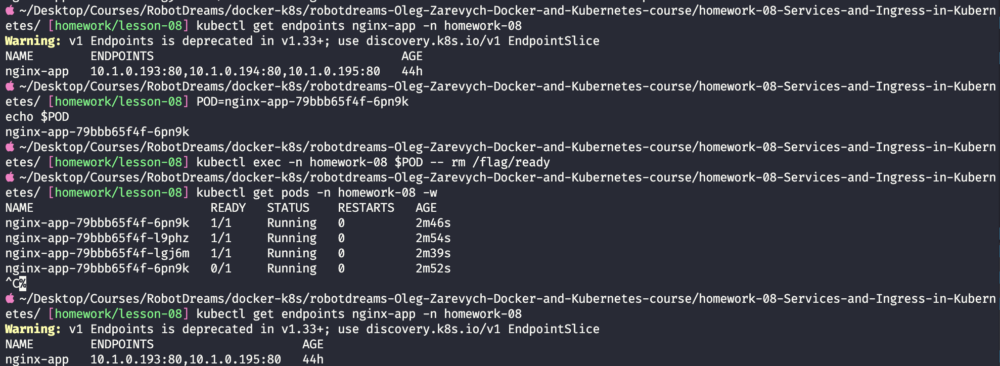

**Под повертається** — після `touch /flag/ready` под знову `1/1`, а `10.1.0.194`
**повертається** в Endpoints — знову 3 IP:

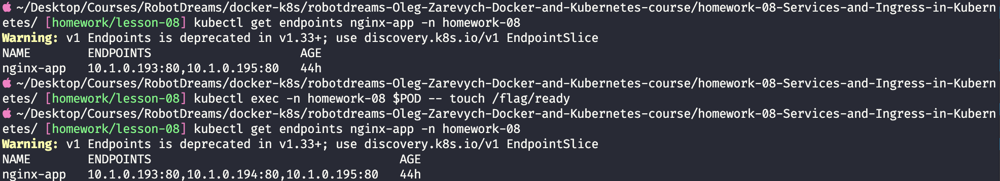

✅ **Результат:** доведено повний цикл —

| Фаза                | Endpoints | Стан пода                                        |
| ------------------- | --------- | ------------------------------------------------ |
| ДО                  | 3 IP      | усі `1/1`                                        |
| `rm /flag/ready`    | 2 IP      | `0/1 Running RESTARTS 0` — не готовий, але живий |
| `touch /flag/ready` | 3 IP      | знову `1/1`                                      |

IP "не готового" пода коректно зник зі списку Endpoints Service, трафік перерозподілився
на 2 живі репліки (монітор `curl` сипав суцільні `200`), а після відновлення файлу
под автоматично повернувся в балансування. liveness при цьому не спрацювала —
контейнер жодного разу не перезапустився (`RESTARTS: 0`).

---

## Завдання 5 — HTTPS через self-signed сертифікат

### Що це таке

**TLS termination** — місце, де зашифрований HTTPS-трафік розшифровується.
Відбувається на Ingress Controller:

```
Браузер --HTTPS (зашифровано)--> Ingress Controller --HTTP (відкрито)--> Service --> Pod
                                       ↑
                                 TLS termination
```

Сертифікат потрібен **тільки Ingress Controller'у** — поди nginx про HTTPS нічого не
знають і працюють на звичайному HTTP `:80`.

> 💡 **Аналогія:** TLS termination — пункт прийому пошти на вході в офіс. Запечатаний
> конверт (зашифровано) розпечатують на рецепції, а далі по офісу несуть уже відкритий
> лист — бо всередині всі свої.

**Self-signed сертифікат** — підписаний самим собою, без довіреного центру сертифікації.
Криптографічно повноцінний (трафік шифрується), але браузер показує попередження,
бо не знає підписанта.

### Крок 1 — генерація сертифіката

```bash
mkdir -p tls
openssl req -x509 -nodes -days 365 -newkey rsa:2048 \
  -keyout tls/tls.key \
  -out tls/tls.crt \
  -subj "/CN=course-app.local/O=homework-08" \
  -addext "subjectAltName=DNS:course-app.local"
```

> `-addext "subjectAltName=..."` обов'язковий — сучасні браузери перевіряють домен
> саме за SAN, а не за `CN`.

### Крок 2 — Secret з сертифікатом

**Secret** — як ConfigMap, але для чутливих даних. Створюємо Secret типу `tls`:

```bash
kubectl create secret tls course-app-tls \
  --cert=tls/tls.crt --key=tls/tls.key \
  -n homework-08

kubectl get secret course-app-tls -n homework-08
```

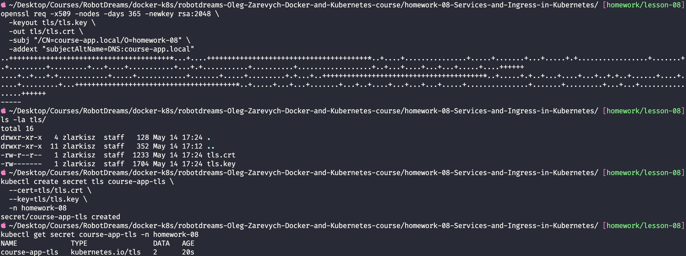

Файли `tls.crt` і `tls.key` створені (ключ має права `-rw-------` — лише власник).
Secret `course-app-tls` типу `kubernetes.io/tls` з `DATA: 2` (сертифікат + ключ).

> ⚠️ `tls.key` — приватний ключ. Тека `tls/` додана в `.gitignore` — у git не потрапляє.

### Крок 3 — Ingress з TLS

Файл `06-ingress-tls.yaml` — це `04-ingress.yaml` плюс:

- секція `spec.tls` — вмикає HTTPS для `course-app.local`, сертифікат із Secret `course-app-tls`;
- анотація `nginx.ingress.kubernetes.io/ssl-redirect: "true"` — HTTP автоматично
  перенаправляється на HTTPS.

```bash
kubectl apply -f 06-ingress-tls.yaml
kubectl get ingress nginx-app -n homework-08
kubectl describe ingress nginx-app -n homework-08

# HTTPS працює (-k бо self-signed)
curl -k https://course-app.local

# HTTP редіректить на HTTPS
curl -I http://course-app.local
```

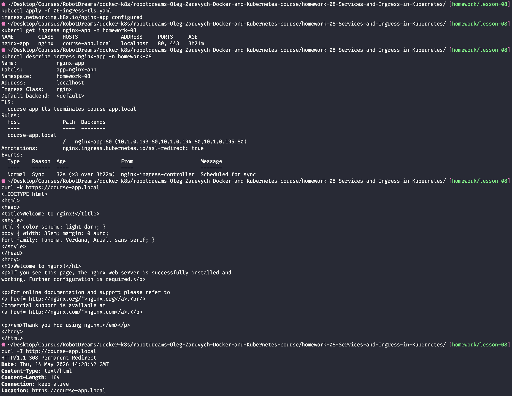

`get ingress` показує `PORTS: 80, 443`. `describe ingress` містить рядок
`TLS: course-app-tls terminates course-app.local` — пряме підтвердження TLS termination.
`curl -k https://` повертає HTML nginx. `curl -I http://` повертає `308 Permanent Redirect`
з `Location: https://course-app.local` — авторедірект працює.

### Перевірка в браузері

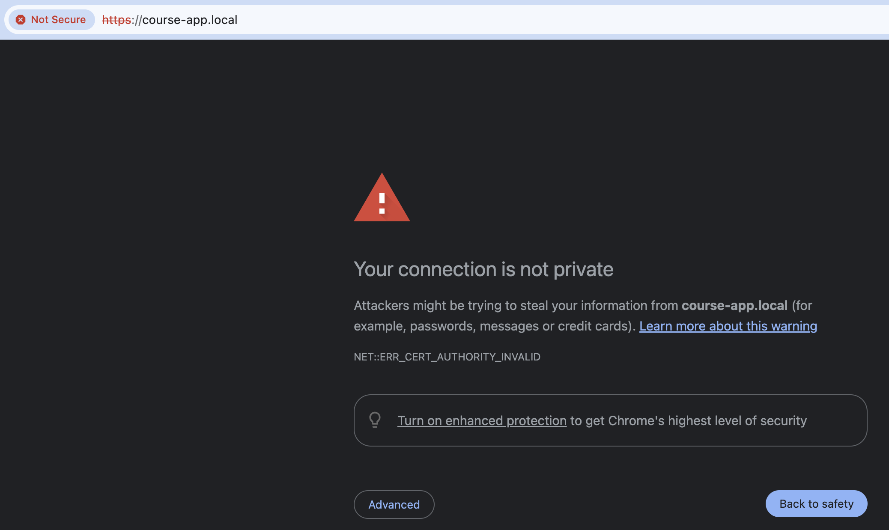

Браузер показує `NET::ERR_CERT_AUTHORITY_INVALID` — це **очікувано і коректно**: код
означає "не можу перевірити, хто підписав сертифікат", а не "шифрування зламане".
Для self-signed сертифіката це нормальна поведінка — TLS-сесія повноцінна, бракує лише
довіри до підписанта (у проді цю роль виконав би Let's Encrypt).

✅ **Результат:** Ingress налаштовано на роботу через HTTPS із self-signed сертифікатом.
TLS termination відбувається на рівні Ingress Controller. HTTP-запити автоматично
перенаправляються на HTTPS (`308`). Поди nginx працюють на звичайному HTTP — про
шифрування "знає" лише Controller.

---

## Висновки

### Статус завдань

| #   | Завдання                                             | Статус |
| --- | ---------------------------------------------------- | ------ |
| 1   | Service: NodePort → ClusterIP                        | ✅     |
| 2   | Health Checks: livenessProbe + readinessProbe        | ✅     |
| 3   | Ingress з доменним ім'ям `course-app.local`          | ✅     |
| 4   | Zero Downtime тест — IP пода зникає з Endpoints      | ✅     |
| 5   | HTTPS через self-signed сертифікат (TLS termination) | ✅     |

### Що було зроблено

Побудовано повний шлях зовнішнього трафіку до застосунку в Kubernetes:
`Browser → Ingress Controller → Service (ClusterIP) → Pod`. Service переведено з
NodePort на ClusterIP (закрито зайву точку входу), додано health checks для
автоматичного контролю стану подів, налаштовано Ingress для доступу за доменним
ім'ям, доведено стійкість сервісу при випадінні пода, увімкнено HTTPS з TLS
termination на Ingress.

### Ключові концепції

| Концепція              | Суть                                                           |
| ---------------------- | -------------------------------------------------------------- |
| **ClusterIP**          | тип Service — адреса, видима лише всередині кластера           |
| **Ingress Controller** | реальний под, що слухає 80/443 і виконує правила маршрутизації |
| **Ingress-ресурс**     | YAML-правило "host → Service", яке читає Controller            |
| **livenessProbe**      | завис → k8s перезапускає контейнер                             |
| **readinessProbe**     | не готовий → k8s прибирає IP з Endpoints (трафік не йде)       |
| **Endpoints**          | список IP готових подів; оновлюється автоматично               |
| **TLS termination**    | розшифрування HTTPS на Ingress; поди працюють по HTTP          |

### Корисні команди

```bash
# --- Service і типи ---
kubectl get svc -n homework-08                       # тип, ClusterIP, порти
kubectl get endpoints <svc> -n homework-08           # IP готових подів

# --- Deployment і поди ---
kubectl get pods -n homework-08 -o wide              # поди + їхні IP + нода
kubectl rollout status deployment/<name> -n homework-08   # стан rolling update
kubectl describe pod -n homework-08 -l app=nginx-app # деталі, probes, events
kubectl get events -n homework-08 --sort-by='.lastTimestamp'  # хронологія подій

# --- Ingress ---
kubectl get ingress -n homework-08                   # host, class, порти
kubectl describe ingress <name> -n homework-08       # правила, TLS, backends
kubectl get pods -n ingress-nginx                    # под Ingress Controller

# --- Перевірка зсередини кластера ---
kubectl run tmp-curl --rm -it --restart=Never -n homework-08 \
  --image=curlimages/curl:8.10.1 -- curl -s http://<svc>

# --- exec у под ---
kubectl exec -n homework-08 <pod> -- <команда>       # виконати команду в контейнері

# --- TLS ---
kubectl create secret tls <name> --cert=<file> --key=<file> -n homework-08
kubectl get secret <name> -n homework-08

# --- HTTP-перевірки ---
curl http://course-app.local                        # через Ingress (HTTP)
curl -k https://course-app.local                    # через Ingress (HTTPS, self-signed)
curl -I http://course-app.local                     # заголовки — побачити редірект

# --- Прибирання ---
kubectl delete ns homework-08                        # знести всю домашку одразу
```
