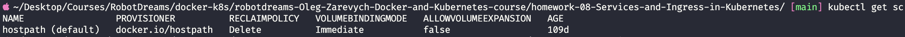
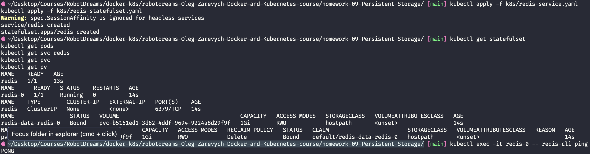
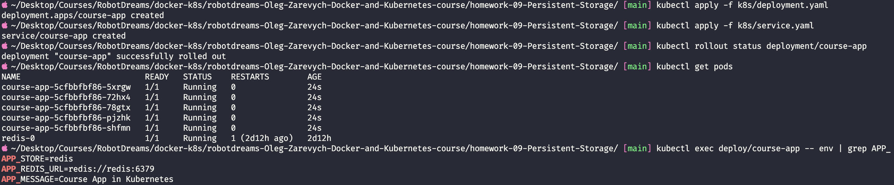
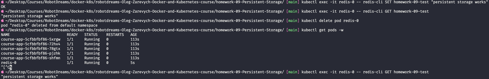

# Домашнє завдання #09 — Робота з Persistent Storage у Kubernetes

Мета: навчитися зберігати дані застосунку так, щоб вони переживали знищення та
перестворення подів — через StatefulSet із `volumeClaimTemplates`, динамічне
виділення дисків (dynamic provisioning) дефолтним StorageClass і підключення
stateless-застосунку course-app до зовнішнього Redis як сховища.

## Зміст

- [Середовище](#середовище)
- [Структура файлів](#структура-файлів)
- [Ключова ідея — навіщо це все](#ключова-ідея--навіщо-це-все)
- [Завдання 1 — Аналіз StorageClass](#завдання-1--аналіз-storageclass)
- [Завдання 2 — Redis як StatefulSet](#завдання-2--redis-як-statefulset)
- [Завдання 3 — Redis Service (headless)](#завдання-3--redis-service-headless)
- [Завдання 4 — Оновлення Deployment course-app](#завдання-4--оновлення-deployment-course-app)
- [Перевірка персистентності — головне демо](#перевірка-персистентності--головне-демо)
- [Висновки](#висновки)

---

## Середовище

| Параметр            | Значення                          |
| ------------------- | --------------------------------- |
| OS                  | macOS (Apple Silicon, arm64)      |
| Kubernetes          | Docker Desktop Kubernetes         |
| Нода                | `docker-desktop` (одна, Linux-VM) |
| kubectl             | вбудований у Docker Desktop       |
| StorageClass        | `hostpath (default)`              |
| Provisioner         | `docker.io/hostpath`              |
| Reclaim Policy      | `Delete`                          |
| Volume Binding Mode | `Immediate`                       |
| Образ Redis         | `redis:7-alpine`                  |
| Образ застосунку    | `zlarkisz/course-app:1.0.1`       |
| Shell               | zsh                               |
| Дата виконання      | 17 травня 2026                    |

> ⚠️ **Розбіжність з умовою завдання.** Завдання написане під **Rancher Desktop**,
> де дефолтний StorageClass зветься `local-path` (provisioner `rancher.io/local-path`).
> У цьому кластері — **Docker Desktop Kubernetes**, де дефолтний клас зветься
> `hostpath` (provisioner `docker.io/hostpath`). Функціонально це те саме: обидва
> створюють фізичні папки на диску хоста під кожен PVC (dynamic provisioning).
> Підказка із завдання — "не вказуйте storageClassName, нехай підтягнеться
> дефолтний" — працює ідентично.

---

## Структура файлів

```
homework-09-Persistent-Storage/
├── k8s/
│   ├── redis-statefulset.yaml   # Завдання 2 — StatefulSet + volumeClaimTemplates
│   ├── redis-service.yaml       # Завдання 3 — headless Service (clusterIP: None)
│   ├── deployment.yaml          # Завдання 4 — course-app, env переведено на Redis
│   └── service.yaml             # Service course-app (NodePort, без змін з hw-06)
├── README.md
└── screenshots/
```

> `deployment.yaml` і `service.yaml` для course-app скопійовано з
> `homework-06-Kubernetes-Basics/k8s/`, щоб ця домашка була самодостатньою
> (можна `kubectl apply -f k8s/` і `kubectl delete -f k8s/` цілим набором).
> Оригінали в homework-06 лишилися незмінними.

---

## Ключова ідея — навіщо це все

Контейнери **ефемерні**: под помер → новий стартує з порожньою файловою системою.
Для stateless-застосунку (вебсервер, API) це нормально. Для бази даних —
катастрофа: рестарт = втрата всіх даних.

Kubernetes вирішує це трьома абстракціями, що працюють у зв'язці:

| Абстракція       | Що це                                                     | Аналогія                     |
| ---------------- | --------------------------------------------------------- | ---------------------------- |
| **StorageClass** | "постачальник дисків" — знає _як_ і _де_ створити сховище | Орендна агенція квартир      |
| **PVC**          | заявка: "потрібен диск 1Gi, режим RWO"                    | Заявка "хочу 1-кімнатну"     |
| **PV**           | сам фізичний диск, виданий за заявкою                     | Конкретна квартира з ключами |

Ланцюжок: пишемо **PVC** → **StorageClass** бачить заявку й автоматично створює
**PV** → под монтує цей PV у себе в папку. Це і є **dynamic provisioning** —
PV не треба створювати руками.

> 💡 **Аналогія StatefulSet vs Deployment:** Deployment — бригада на зміну:
> працівники однакові, безіменні, будь-кого можна замінити, нічого свого вони
> не зберігають. StatefulSet — працівники з **іменними шафками**: позицію №0
> завжди займає той, хто стоїть на №0, у його шафці — його інструмент. Захворів —
> заміна стає на №0 і отримує **ту саму шафку з тим самим інструментом**.

Тому Redis (стан!) — це StatefulSet, а course-app (stateless) — Deployment.

---

## Завдання 1 — Аналіз StorageClass

`StorageClass` описує **спосіб надання дисків** у кластері: який provisioner їх
створює, де фізично лежать дані, яка політика очищення. Позначка `(default)`
критична: коли PVC **не вказує** `storageClassName`, Kubernetes бере саме
дефолтний клас. На цьому побудована підказка із завдання 2.

### Команда

```bash
kubectl get sc
```

`sc` — скорочення від `storageclass`.

### Що отримано

```
NAME                 PROVISIONER          RECLAIMPOLICY   VOLUMEBINDINGMODE   ALLOWVOLUMEEXPANSION   AGE
hostpath (default)   docker.io/hostpath   Delete          Immediate           false                  109d
```



Розбір виводу по колонках:

| Колонка                | Значення             | Що означає для домашки                                             |
| ---------------------- | -------------------- | ------------------------------------------------------------------ |
| `NAME`                 | `hostpath (default)` | Клас є і він дефолтний → PVC без `storageClassName` підтягне його  |
| `PROVISIONER`          | `docker.io/hostpath` | Вбудований провізор Docker Desktop. Аналог `rancher.io/local-path` |
| `RECLAIMPOLICY`        | `Delete`             | Видалили PVC → фізична папка з даними теж видаляється              |
| `VOLUMEBINDINGMODE`    | `Immediate`          | PV створюється одразу за PVC, не чекаючи пода                      |
| `ALLOWVOLUMEEXPANSION` | `false`              | Розмір диска не розширюється після створення (нам 1Gi досить)      |
| `AGE`                  | `109d`               | Клас живе з моменту увімкнення Kubernetes у Docker Desktop         |

### `local-path` vs `hostpath` — порівняння

| Параметр               | Rancher Desktop (умова) | Docker Desktop (цей кластер) |
| ---------------------- | ----------------------- | ---------------------------- |
| Назва класу            | `local-path`            | `hostpath`                   |
| Provisioner            | `rancher.io/local-path` | `docker.io/hostpath`         |
| `(default)`?           | ✅ так                  | ✅ так                       |
| Reclaim Policy         | `Delete`                | `Delete`                     |
| Фізично                | папки на диску хоста    | папки на диску хоста         |
| Придатність до домашки | ✅                      | ✅                           |

### `Immediate` vs `WaitForFirstConsumer`

У Rancher дефолтний клас має `WaitForFirstConsumer` — PV створюється лише коли
з'явиться под, що його хоче (важливо в багатонодових кластерах, щоб диск і под
не опинились на різних машинах). У Docker Desktop тут `Immediate` — PV
створюється одразу. Оскільки нода **одна**, різниці на практиці немає: PVC
одразу стає `Bound`, а не зависає в `Pending`.

> 💡 **Чому варто перевіряти `(default)`:** якби дефолтного класу не було, PVC
> із завдання 2 завис би в `Pending` назавжди — нікому було б його обслужити.

✅ **Результат:** дефолтний StorageClass у кластері є (`hostpath`), готовий до
dynamic provisioning.

---

## Завдання 2 — Redis як StatefulSet

### Чому StatefulSet, а не Deployment

Deployment не вміє трьох речей, які потрібні базі даних:

| Властивість    | Deployment             | StatefulSet                              |
| -------------- | ---------------------- | ---------------------------------------- |
| Імена подів    | випадкові (`app-7d9f`) | порядкові: `redis-0`, `redis-1`          |
| Після рестарту | нове випадкове ім'я    | **те саме** ім'я                         |
| Диск           | спільний / ефемерний   | свій PVC на под (`volumeClaimTemplates`) |
| Запуск/зупинка | паралельно             | по черзі: `0 → 1 → 2`                    |
| Призначення    | stateless              | stateful (БД, черги)                     |

### Як працює `volumeClaimTemplates`

Це головна "фішка" StatefulSet. Замість того щоб писати PVC окремим маніфестом,
ми даємо **шаблон**, з якого StatefulSet сам штампує PVC для кожного пода:

```
volumeClaimTemplates (шаблон)
        │
        ↓  StatefulSet створює PVC за формулою <шаблон>-<sts>-<N>
        │
   redis-0  →  PVC redis-data-redis-0  →  PV  →  папка на диску Mac
```

Ім'я PVC: `<назва-шаблону>-<назва-statefulset>-<номер>` = `redis-data-redis-0`.

> ⚠️ **Життєвий цикл:** PVC, створені з `volumeClaimTemplates`, **не видаляються**
> разом зі StatefulSet. Це навмисний захист від випадкової втрати даних.
> Прибирати треба окремо: `kubectl delete pvc redis-data-redis-0`.

### Чому монтуємо саме в `/data`

Офіційний образ `redis` за замовчуванням використовує `/data` як робочу
директорію і періодично скидає снапшот бази у файл `/data/dump.rdb`
(механізм RDB-персистенції). Якщо persistent volume змонтувати саме в `/data` —
`dump.rdb` опиняється на постійному диску і переживає перестворення пода.
Змонтуй в інше місце — Redis писатиме dump у ефемерну ФС, і сенс домашки втрачено.

### Відповідність вимогам завдання

| Вимога завдання               | У маніфесті                             |
| ----------------------------- | --------------------------------------- |
| `kind: StatefulSet`           | `kind: StatefulSet`                     |
| образ `redis:7-alpine`        | `image: redis:7-alpine`                 |
| назва шаблону `redis-data`    | `volumeClaimTemplates[].metadata.name`  |
| розмір `1Gi`                  | `resources.requests.storage: 1Gi`       |
| `AccessMode: ReadWriteOnce`   | `accessModes: [ReadWriteOnce]`          |
| не вказувати storageClassName | поле відсутнє → підтягується `hostpath` |
| змонтувати в `/data`          | `volumeMounts[].mountPath: /data`       |

> Деталь: StatefulSet має **обов'язкове** поле `spec.serviceName: redis` —
> воно посилається на headless Service із завдання 3. Маніфести можна
> створювати в будь-якому порядку, об'єкти "знаходять" одне одного по іменах.

### Застосування та перевірка

```bash
kubectl apply -f k8s/redis-service.yaml
kubectl apply -f k8s/redis-statefulset.yaml

kubectl get statefulset
kubectl get pods
kubectl get svc redis
kubectl get pvc
kubectl get pv
```



Результат із виводу:

| Перевірка         | Що бачимо                                          | Висновок                                       |
| ----------------- | -------------------------------------------------- | ---------------------------------------------- |
| `get statefulset` | `redis 1/1 READY`                                  | StatefulSet створено, 1 репліка готова         |
| `get pods`        | `redis-0 Running`                                  | **Передбачуване ім'я** — підпис StatefulSet    |
| `get svc redis`   | `CLUSTER-IP: None`                                 | Headless service (деталі — завдання 3)         |
| `get pvc`         | `redis-data-redis-0 Bound 1Gi RWO hostpath`        | **Ключове:** PVC за формулою, статус `Bound`   |
| `get pv`          | `pvc-b5161ed1... Bound default/redis-data-redis-0` | PV створено автоматично — dynamic provisioning |

Колонка `CLAIM` у `kubectl get pv` = `default/redis-data-redis-0` — це фізичний
доказ повного ланцюга `volumeClaimTemplates → PVC → PV → папка на диску`.

> Попередження `spec.SessionAffinity is ignored for headless services` —
> не помилка. Поле `sessionAffinity` не має сенсу для headless service (він не
> балансує). Підставляється дефолт, K8s просто інформує.

✅ **Результат:** StatefulSet `redis` працює, под `redis-0` у `Running`, PVC
`redis-data-redis-0` у статусі `Bound`, PV виділено автоматично.

---

## Завдання 3 — Redis Service (headless)

### Чому ClusterIP, а не NodePort

До Redis звертається **тільки course-app, зсередини кластера**. Браузером у
Redis ніхто не лізе → пробивати порт назовні (`NodePort`) не потрібно й
небезпечно. Достатньо внутрішнього доступу.

### Чому headless (`clusterIP: None`), а не звичайний ClusterIP

| Властивість               | Звичайний ClusterIP    | Headless (`clusterIP: None`) |
| ------------------------- | ---------------------- | ---------------------------- |
| Власна IP                 | так, віртуальна        | нема                         |
| Балансування              | так (kube-proxy)       | нема                         |
| DNS `redis` →             | віртуальна ClusterIP   | напряму IP подів             |
| DNS подів `redis-0.redis` | ❌ не працює           | ✅ працює                    |
| Для чого                  | stateless (course-app) | stateful (StatefulSet)       |

Headless service — **канонічний партнер StatefulSet**: поле `serviceName` у
StatefulSet існує саме для нього. У нашому випадку (1 репліка) вистачило б і
звичайного ClusterIP, але `clusterIP: None` — це "як належить", і коректно
масштабується, якщо реплік стане більше.

> 💡 **Аналогія:** звичайний ClusterIP — гаряча лінія кол-центру (один номер,
> відповідає випадковий вільний оператор). Headless service — внутрішній
> довідник з прямими номерами: можна подзвонити саме "redis-0".

✅ **Результат:** headless Service `redis` створено, `kubectl get svc redis`
показує `CLUSTER-IP: None` (див. скріншот завдання 2).

---

## Завдання 4 — Оновлення Deployment course-app

course-app у homework-06 писав у локальний sqlite. Тепер переводимо його на
зовнішній Redis — змінюємо тільки секцію `env`.

| Змінна          | Значення             | Що робить                                   |
| --------------- | -------------------- | ------------------------------------------- |
| `APP_STORE`     | `redis`              | Перемикає backend сховища з sqlite на redis |
| `APP_REDIS_URL` | `redis://redis:6379` | Адреса, за якою course-app знаходить Redis  |

Розбір `redis://redis:6379`:

```
redis://redis:6379
  │       │     └─ порт зі spec.ports.port у redis-service.yaml
  │       └─────── ХОСТ = DNS-ім'я Service "redis" (metadata.name).
  │                НЕ ім'я пода, НЕ IP! DNS K8s резолвить → под redis-0.
  └─────────────── схема протоколу Redis
```

Ключове: `redis` посередині — **DNS-ім'я Service**, не IP пода. Якщо `redis-0`
перестворять з іншою IP — course-app не помітить, бо звертається за стабільним
іменем. Саме для цього й потрібен був Service.

> 💡 **Аналогія:** `APP_REDIS_URL` — як контакт "Redis" у телефоні замість
> запам'ятовування номера. Людина змінила номер (под перестворився) — ти
> однаково дзвониш по контакту й потрапляєш куди треба.

> ⚠️ env-змінні **не оновлюються на льоту** (на відміну від ConfigMap-volume з
> hw-07). Потрібен `kubectl apply` → Deployment запускає rolling update, усі 5
> подів course-app поступово замінюються на нові з Redis-конфігом. Завдяки
> `maxUnavailable: 0` — без даунтайму.

### Застосування

```bash
kubectl apply -f k8s/deployment.yaml
kubectl apply -f k8s/service.yaml
kubectl rollout status deployment/course-app
kubectl get pods
kubectl exec deploy/course-app -- env | grep APP_
```



Вивід `env | grep APP_` показує `APP_STORE=redis` і
`APP_REDIS_URL=redis://redis:6379` — env реально долетіли в контейнер.

✅ **Результат:** course-app переведено на Redis, rolling update пройшов чисто
(новий ReplicaSet, 5 подів `Running`), env підтверджено зсередини контейнера.

---

## Перевірка персистентності — головне демо

Суть усієї домашки: довести, що дані переживають **повне знищення пода**.

```bash
# 1. Записати ключ у Redis
kubectl exec -it redis-0 -- redis-cli SET homework-09-test "persistent storage works"
kubectl exec -it redis-0 -- redis-cli GET homework-09-test     # → "persistent storage works"

# 2. Знищити под повністю
kubectl delete pod redis-0
kubectl get pods -w                                            # redis-0 перестворюється

# 3. Перевірити дані після перестворення
kubectl exec -it redis-0 -- redis-cli GET homework-09-test     # → "persistent storage works"
```



Що довів вивід:

| Момент                     | Стан `redis-0`            | Дані                           |
| -------------------------- | ------------------------- | ------------------------------ |
| До видалення               | `AGE 2d12h`, `RESTARTS 1` | `SET` → `OK`, `GET` → значення |
| Після `kubectl delete pod` | під знищено               | —                              |
| Після перестворення        | `AGE 5s`, `RESTARTS 0`    | `GET` → **значення на місці**  |

Критична деталь: новий `redis-0` має `AGE 5s` і `RESTARTS 0` — це **не рестарт
контейнера, а повністю новий под** з чистою файловою системою. І все одно `GET`
повертає дані. Бо вони не в поді — вони в PVC:

```
redis-0 помер  →  PVC redis-data-redis-0 ЛИШИВСЯ (захист StatefulSet)
                        ↓
новий redis-0  →  монтує ТОЙ САМИЙ PVC у /data
                        ↓
Redis старт    →  знаходить /data/dump.rdb  →  піднімає базу
                        ↓
GET homework-09-test  →  "persistent storage works"  ✅
```

✅ **Результат:** дані пережили повне знищення пода. Persistent storage працює.

---

## Висновки

### Статус завдань

| #   | Завдання                                          | Статус |
| --- | ------------------------------------------------- | ------ |
| 1   | Аналіз StorageClass (`hostpath` default)          | ✅     |
| 2   | Redis StatefulSet + `volumeClaimTemplates` (1Gi)  | ✅     |
| 3   | Redis Service — headless (`clusterIP: None`)      | ✅     |
| 4   | course-app → Redis (`APP_STORE`, `APP_REDIS_URL`) | ✅     |
| —   | Демо: дані пережили знищення пода `redis-0`       | ✅     |

### Що було зроблено

Збудовано повний ланцюг персистентного зберігання в Kubernetes:
`volumeClaimTemplates → PVC → PV → папка на диску хоста`. Redis розгорнуто як
StatefulSet (стабільне ім'я пода + власний диск, що переживає перестворення),
підключено через headless Service, stateless-застосунок course-app переведено
з локального sqlite на зовнішній Redis. Доведено головну тезу persistent
storage: контейнери ефемерні, дані на PVC — ні.

### Ключові концепції

| Концепція                 | Суть                                                                 |
| ------------------------- | -------------------------------------------------------------------- |
| **StorageClass**          | постачальник дисків; `(default)` використовується без явної вказівки |
| **PVC**                   | заявка на диск; формула імені `<шаблон>-<sts>-<N>`                   |
| **PV**                    | сам диск; створюється автоматично (dynamic provisioning)             |
| **StatefulSet**           | стабільні імена подів + власний PVC на кожен под                     |
| **volumeClaimTemplates**  | шаблон, з якого StatefulSet штампує PVC; PVC переживає STS           |
| **Headless Service**      | `clusterIP: None`; без балансування; DNS прямо на поди               |
| **Reclaim Policy Delete** | видалили PVC → дані фізично зникають                                 |
| **RDB-персистенція**      | Redis скидає снапшот у `/data/dump.rdb` — тому монтуємо `/data`      |

### Корисні команди

```bash
# --- StorageClass ---
kubectl get sc                                  # список класів, який default
kubectl describe sc hostpath                    # деталі провізора

# --- StatefulSet ---
kubectl get statefulset                         # стан, READY
kubectl describe statefulset redis              # події, volumeClaimTemplates
kubectl get pods -l app=redis                   # поди Redis (redis-0, ...)

# --- PVC / PV ---
kubectl get pvc                                 # заявки: статус Bound/Pending
kubectl get pv                                  # диски + до якого PVC прив'язані
kubectl describe pvc redis-data-redis-0         # деталі заявки, події

# --- Redis зсередини ---
kubectl exec -it redis-0 -- redis-cli ping            # PONG = живий
kubectl exec -it redis-0 -- redis-cli SET <k> <v>     # записати ключ
kubectl exec -it redis-0 -- redis-cli GET <k>         # прочитати ключ
kubectl exec -it redis-0 -- redis-cli KEYS '*'        # усі ключі

# --- course-app ---
kubectl rollout status deployment/course-app    # стан rolling update
kubectl exec deploy/course-app -- env | grep APP_     # перевірити env у контейнері

# --- Демо персистентності ---
kubectl delete pod redis-0                      # знищити под (PVC лишається!)
kubectl get pods -w                             # дивитися перестворення

# --- Прибирання (PVC треба видаляти ОКРЕМО) ---
kubectl delete -f k8s/                          # знести Deployments/Services/STS
kubectl delete pvc redis-data-redis-0           # дані прибираються тільки так
```
