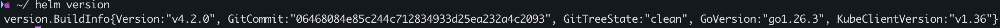
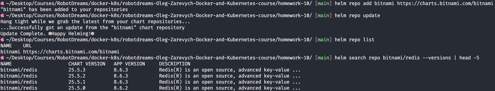
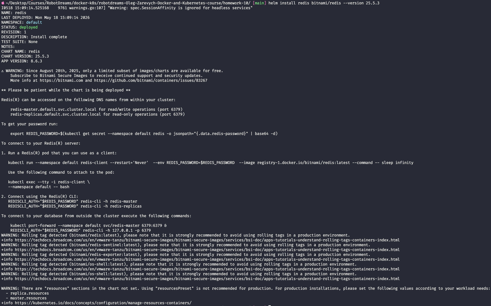
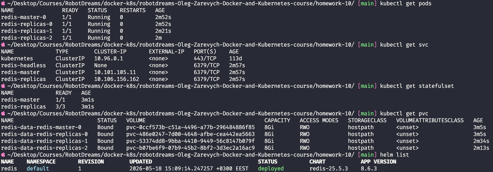
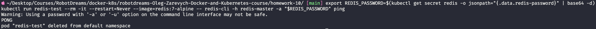
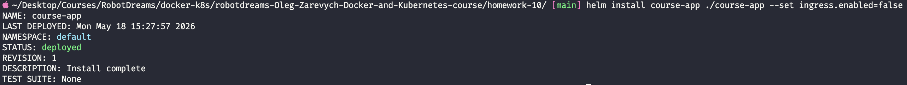
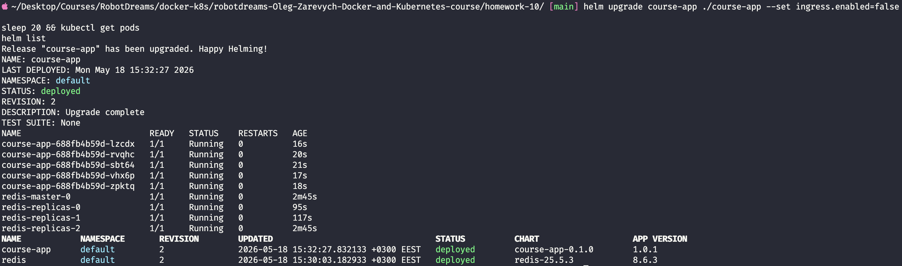
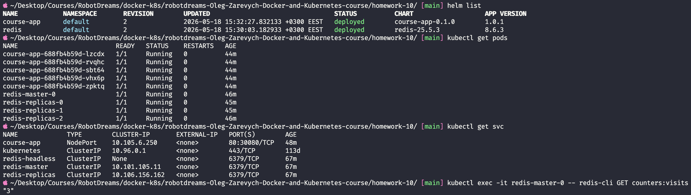

# Домашнє завдання #10 — Автоматизація розгортання за допомогою Helm

## Зміст

- [Середовище](#середовище)
- [Мета](#мета)
- [Підготовка — очищення кластера](#підготовка--очищення-кластера)
- [Завдання 0 — Встановлення Helm](#завдання-0--встановлення-helm)
- [Завдання 1 — Власний Helm-чарт course-app](#завдання-1--власний-helm-чарт-course-app)
- [Завдання 2 — Redis через Bitnami chart](#завдання-2--redis-через-bitnami-chart)
- [Завдання 3 — Інтеграція course-app ↔ Redis](#завдання-3--інтеграція-course-app--redis)
- [Реальні пастки, які зустрілись](#реальні-пастки-які-зустрілись)
- [Бонус — Redis як subchart-залежність](#бонус--redis-як-subchart-залежність)
- [Висновки](#висновки)

---

## Середовище

| Параметр         | Значення                              |
| ---------------- | ------------------------------------- |
| OS               | macOS (Apple Silicon, arm64)          |
| Kubernetes       | Docker Desktop (single-node)          |
| Helm             | v4.2.0                                |
| kubectl          | v1.36                                 |
| Shell            | zsh                                   |
| Образ застосунку | `zlarkisz/course-app:1.0.1` (FastAPI) |
| Bitnami Redis    | chart `25.5.3`, Redis `8.6.3`         |
| Дата виконання   | 18 травня 2026                        |

---

## Мета

Перенести інфраструктуру з попередніх домашніх завдань (App + Redis + Ingress) з "сирих" маніфестів (`kubectl apply`) у керований Helm-чарт:

1. Власний чарт `course-app` (Deployment, Service, Ingress) з параметризацією через `values.yaml`
2. Redis через ком'юніті-чарт `bitnami/redis` (без власного StatefulSet)
3. Інтеграція: `course-app` підключається до Redis, розгорнутого через Bitnami

> 💡 **Аналогія:** Сирий маніфест — це лист, написаний від руки конкретній людині. Helm-чарт — шаблон листа з полями для підстановки. Один шаблон → багато персоналізованих розгортань. `values.yaml` — таблиця з даними для підстановки.

**Що дає Helm понад `kubectl apply`:**

| Проблема сирих маніфестів                           | Рішення Helm                                    |
| --------------------------------------------------- | ----------------------------------------------- |
| Хардкод → копіюй і прав руками під кожне середовище | шаблонізація: один шаблон + різні `values`      |
| `kubectl delete -f` по кожному файлу окремо         | реліз як одиниця: `helm uninstall` прибирає все |
| Немає історії, відкату нема                         | `helm rollback` повертає попередню версію       |

---

## Підготовка — очищення кластера

Перед роботою прибрано ресурси попередніх домашок (course-app + Redis StatefulSet + PVC з homework-09), щоб почати з чистого стану.

```bash
kubectl delete deployment course-app
kubectl delete service course-app
kubectl delete statefulset redis
kubectl delete service redis
kubectl delete pvc redis-data-redis-0
```

> 💡 **Чому PVC видаляється окремо:** видалення StatefulSet НЕ видаляє його PVC автоматично — це навмисний захист Kubernetes від випадкової втрати даних БД. Reclaim policy `Delete` → після видалення PVC том PV зникає сам.

✅ Кластер очищено: лишився тільки системний `service/kubernetes`, PVC/PV порожні, `helm list` порожній.

---

## Завдання 0 — Встановлення Helm

Helm — менеджер пакетів для Kubernetes (як `npm` для Node). Docker Desktop приносить лише `kubectl`, Helm ставиться окремо.

```bash
brew install helm
helm version
```

### Скріншот



✅ Helm `v4.2.0` встановлено, KubeClient `v1.36`.

---

## Завдання 1 — Власний Helm-чарт course-app

### Структура чарту

```
course-app/
├── Chart.yaml          # паспорт чарту (метадані, версії)
├── values.yaml         # всі параметри (хардкоду в шаблонах немає)
├── .helmignore         # що не пакувати
└── templates/
    ├── _helpers.tpl    # генерація імен і лейблів
    ├── deployment.yaml # шаблонізований homework-09/deployment.yaml
    ├── service.yaml    # шаблонізований homework-09/service.yaml
    └── ingress.yaml    # шаблонізований homework-08/04-ingress.yaml
```

### `Chart.yaml` — дві різні версії

| Поле         | Що версіонує                         | Коли підвищувати         |
| ------------ | ------------------------------------ | ------------------------ |
| `version`    | сам чарт (шаблони, структуру values) | змінив `templates/`      |
| `appVersion` | застосунок усередині (тег образу)    | випустив новий код/образ |

> 💡 **Аналогія:** `version` — версія _рецепта_ (як готувати). `appVersion` — версія _страви_ (що приготували).

### `values.yaml` — критерій винесення параметрів

Головне правило: **значення йде в `values.yaml`, якщо воно зміниться при розгортанні в іншому середовищі** (інший namespace, dev/prod, інший образ). Структурні речі (`apiVersion`, `kind`) лишаються в шаблоні.

| Значення (було хардкодом)          | Винесено в `values.yaml`?           |
| ---------------------------------- | ----------------------------------- |
| `replicas: 5`                      | ✅ `replicaCount`                   |
| `image: zlarkisz/course-app:1.0.1` | ✅ `image.repository` + `image.tag` |
| `host: course-app.local` (Ingress) | ✅ `ingress.host`                   |
| `containerPort: 8080`              | ✅ `container.port`                 |
| `namespace: homework-08`           | ❌ ПРИБРАНО (задається через `-n`)  |
| `apiVersion: apps/v1`              | ❌ структура — лишається в шаблоні  |

### Ключові прийоми шаблонізації

| Конструкція                  | Призначення                                    |
| ---------------------------- | ---------------------------------------------- |
| `{{ .Values.x }}`            | підстановка значення з `values.yaml`           |
| `{{ .Release.Name }}`        | ім'я релізу (для динамічних імен ресурсів)     |
| `{{ include "x" . }}`        | вставка іменованого шаблону з `_helpers.tpl`   |
| `{{ if }} ... {{ end }}`     | умовна генерація (вмикач Ingress / nodePort)   |
| `\| nindent N` / `\| toYaml` | вставка блоку з коректним відступом            |
| `\| quote`                   | обгортання в лапки (захист від YAML-сюрпризів) |

**Усунення хардкоду імен** (`_helpers.tpl`): ім'я ресурсу = `<реліз>-<чарт>`, тому два релізи одного чарту не конфліктують. Селектор-лейбли винесено окремо від загальних, бо selector у Kubernetes **незмінний** після створення.

### Перевірка чарту

```bash
helm lint course-app
helm template course-app ./course-app
helm template course-app ./course-app --set replicaCount=1 --set ingress.enabled=false
```

✅ `helm lint` → `0 chart(s) failed`. `helm template` рендерить коректний YAML, усі `{{ }}` замінені реальними значеннями. З `--set` параметри змінюються без правки файлів — хардкоду немає.

---

## Завдання 2 — Redis через Bitnami chart

Замість власного StatefulSet — ком'юніті-чарт `bitnami/redis`.

### Підключення репозиторію

```bash
helm repo add bitnami https://charts.bitnami.com/bitnami
helm repo update
helm search repo bitnami/redis --versions | head -5
```

| Команда            | Що робить                                 |
| ------------------ | ----------------------------------------- |
| `helm repo add`    | реєструє джерело чартів (як npm registry) |
| `helm repo update` | стягує свіжий індекс чартів               |
| `helm search repo` | показує доступні версії                   |

### Скріншот



✅ Репозиторій `bitnami` додано, найновіший чарт `redis` — `25.5.3` (Redis `8.6.3`).

### Встановлення

```bash
helm install redis bitnami/redis --version 25.5.3
```

### Скріншот



У виводі install Bitnami одразу показав офіційне попередження про deprecation (детальніше — у секції "Реальні пастки"). Чарт `25.5.3` уже адаптований під нову модель і тягне `latest`-теги, тому образи витяглись успішно.

Чарт розгорнув топологію master-replica: `redis-master-0` (read/write) + 3× `redis-replicas` (read-only), кожен зі своїм PVC 8Gi.

### Три Service'и Bitnami Redis

| Service          | TYPE               | Для кого                              |
| ---------------- | ------------------ | ------------------------------------- |
| `redis-master`   | ClusterIP          | **клієнти (course-app)** — read/write |
| `redis-replicas` | ClusterIP          | клієнти, яким треба тільки читання    |
| `redis-headless` | ClusterIP **None** | внутрішня координація подів Redis     |

> 💡 **Чому course-app → `redis-master`, а не `redis-headless`:** застосунок пише дані. Писати можна тільки в master. `redis-headless` віддає список усіх подів без розбору (можна випасти на replica → помилка запису). `redis-master` має селектор тільки на master-под → запис гарантовано проходить. Headless потрібен самим подам Redis для реплікації, не клієнтам.

### Скріншот — поди, сервіси, StatefulSet, PVC



### Перевірка, що Redis живий

```bash
export REDIS_PASSWORD=$(kubectl get secret redis -o jsonpath="{.data.redis-password}" | base64 -d)
kubectl run redis-test --rm -it --restart=Never --image=redis:7-alpine -- \
  redis-cli -h redis-master -a "$REDIS_PASSWORD" ping
```

### Скріншот



✅ Redis відповів `PONG` — `redis-master` Service маршрутизує на живий майстер, Redis приймає запити.

---

## Завдання 3 — Інтеграція course-app ↔ Redis

Оновлено **тільки `values.yaml`** (шаблони не чіпались — у цьому сенс шаблонізації):

| Параметр                | Було (homework-09) | Стало (Крок 3) |
| ----------------------- | ------------------ | -------------- |
| `app.redisHost`         | `redis`            | `redis-master` |
| `app.redisAuth.enabled` | —                  | `false`        |

### Перша спроба — install (Ingress webhook + auth)

```bash
helm install course-app ./course-app --set ingress.enabled=false
```



> `--set ingress.enabled=false` — на docker-desktop немає NGINX Ingress Controller, вмикач із чарту прибирає Ingress повністю. Це і є демонстрація гнучкості з вимоги завдання.

Перша спроба дала `CrashLoopBackOff` через `AuthenticationError` (Bitnami Redis за замовчуванням з паролем, а образ `1.0.1` будує конект лише з URL). Рішення — Redis без пароля + `helm upgrade` (детально нижче в "Реальних пастках").

### Робочий стан після upgrade

```bash
helm upgrade redis bitnami/redis --version 25.5.3 --set auth.enabled=false
helm upgrade course-app ./course-app --set ingress.enabled=false
kubectl get pods
helm list
```

### Скріншот



✅ Усі 5 подів `course-app` → `Running 1/1`, RESTARTS 0. Обидва релізи `deployed`, REVISION 2.

### Наскрізна перевірка (App → Redis → App)

```bash
kubectl port-forward svc/course-app 8080:80 &
curl -s http://localhost:8080/         # лічильник visits інкрементиться
kubectl exec -it redis-master-0 -- redis-cli GET counters:visits
```

### Скріншот



✅ Лічильник `visits` у застосунку зростав `1 → 2 → 3`, а `redis-cli GET counters:visits` повернув `"3"` — значення реально записалось у Bitnami Redis через `redis-master`. Інтеграція підтверджена фактично, не за статусом пода.

---

## Реальні пастки, які зустрілись

Окрема секція — реальні проблеми й те, як вони діагностувались (найцінніший досвід завдання).

### 1. Bitnami deprecation (серпень 2025)

Broadcom (новий власник Bitnami) перевів каталог на платну модель. Більшість версійних образів виведено з `docker.io/bitnami` у `docker.io/bitnamilegacy`. Сам чарт залишився безкоштовним. Чарт `25.5.3` уже адаптований — тягне `latest`-теги (попередження `Rolling tag detected` у виводі install). Образи витяглись, `ImagePullBackOff` не сталось.

> ⚠️ Свідомий компроміс: `latest` недетермінований (завтра за тим самим тегом може приїхати інший образ). Для навчальної домашки прийнятно; у проді пінять конкретний дайджест.

### 2. `unexpected EOF` у шаблоні

`helm lint` падав на `ingress.yaml`. Причина — текст `{{ if }}` усередині YAML-коментаря `#`. Helm-шаблонізатор парсить файл **до** YAML і бачить `{{ if }}` у коментарі як справжню відкриту конструкцію без `{{ end }}`.

**Діагностика** — підрахунок балансу блоків:

```bash
grep -oE '\{\{-? *(if|range|with)' file | wc -l   # відкривні
grep -oE '\{\{-? *end' file | wc -l               # закривні
```

**Висновок:** у Helm-шаблонах `{{ }}` магічні **скрізь**, навіть у `#`-коментарях. У коментарях писати без дужок.

### 3. `AuthenticationError: Authentication required`

`course-app` падав у `CrashLoopBackOff`. Лог показав: застосунок доходив до Redis (DNS, мережа працювали), але Bitnami Redis за замовчуванням вимагає пароль, а образ `1.0.1` будує конект лише з `APP_REDIS_URL` і не читає окрему змінну пароля.

**Рішення:** `helm upgrade redis bitnami/redis --set auth.enabled=false` — Redis без пароля (свідомий вибір для навчальної домашки). Альтернатива для проду — вшити пароль у connection URL із Secret.

> 💡 Урок: `STATUS: Running` ≠ "працює". Завжди перевіряти логи (`kubectl logs --previous`) і наскрізний сценарій, а не статус пода.

---

## Бонус — Redis як subchart-залежність

Альтернатива окремому `helm install`: оголосити Redis залежністю в `Chart.yaml`:

```yaml
dependencies:
  - name: redis
    version: "25.5.3"
    repository: "https://charts.bitnami.com/bitnami"
```

```bash
helm dependency build course-app
helm install course-app ./course-app   # піднімає і app, і Redis одним релізом
```

| Підхід                 | Плюси                                                       | Мінуси                                            |
| ---------------------- | ----------------------------------------------------------- | ------------------------------------------------- |
| Окремий `helm install` | прозоро, видно межу відповідальності, кожен пункт ДЗ окремо | два релізи керувати вручну                        |
| Subchart-залежність    | один реліз, один `helm install`                             | складніше, Redis "захований", неймспейсинг values |

Для цієї домашки обрано **окремий install** — він наочно показує service discovery (course-app → `redis-master` через DNS), що і є головною темою завдання.

---

## Висновки

### Статус завдань

| #   | Завдання                                             | Статус |
| --- | ---------------------------------------------------- | ------ |
| 0   | Встановити Helm                                      | ✅     |
| 1   | Власний чарт course-app (Deployment/Service/Ingress) | ✅     |
| 1.1 | Параметризація через `values.yaml`                   | ✅     |
| 1.2 | Усунення хардкоду (namespace, імена, host)           | ✅     |
| 2   | Redis через `bitnami/redis`                          | ✅     |
| 2.1 | Додати Helm-репозиторій                              | ✅     |
| 3   | Інтеграція course-app ↔ redis-master                 | ✅     |
| 3.1 | Наскрізна перевірка (лічильник у Redis)              | ✅     |

### Корисні команди

```bash
# Репозиторії
helm repo add <name> <url>            # додати джерело чартів
helm repo update                      # оновити індекс
helm search repo <chart> --versions   # доступні версії

# Розробка чарту
helm lint <chart>                     # перевірка синтаксису
helm template <release> <chart>       # рендер YAML без установки (дебаг)
helm template ... --set key=val       # перевірити параметризацію

# Релізи
helm install <release> <chart>        # встановити
helm upgrade <release> <chart>        # оновити (REVISION++)
helm upgrade ... --set key=val        # оновити з перевизначенням
helm list                             # список релізів
helm uninstall <release>              # видалити весь реліз
helm rollback <release> <revision>    # відкат до версії

# Дебаг подів
kubectl get pods                      # статуси
kubectl logs <pod>                    # логи
kubectl logs <pod> --previous         # логи впалого контейнера (CrashLoop)
kubectl describe pod <pod>            # Events — причина проблеми
kubectl exec -it <pod> -- <cmd>       # команда всередині пода

# Перевірка інтеграції
kubectl port-forward svc/<svc> 8080:80                   # прокинути порт локально
kubectl exec -it redis-master-0 -- redis-cli GET <key>   # перевірити дані в Redis
```

### Головні висновки

1. **Helm = шаблон + значення.** Винось у `values.yaml` те, що змінюється між середовищами; структуру лишай у шаблонах.
2. **Реліз — атомарна одиниця.** Один `helm install` створює десятки ресурсів, один `helm uninstall` прибирає все.
3. **Service discovery через DNS.** `course-app` знаходить Redis за іменем `redis-master`, а не за IP пода — імена стабільні, IP ефемерні.
4. **`Running` ≠ "працює".** Завжди перевіряй логи й наскрізний сценарій.
5. **Не довіряй методичці наосліп.** Bitnami deprecation — реальна зміна; завжди перевіряй фактичний стан, а не припущення.
