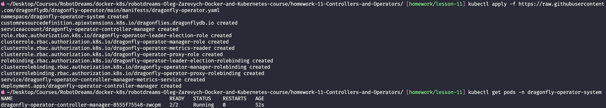
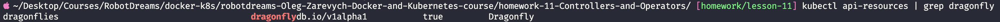
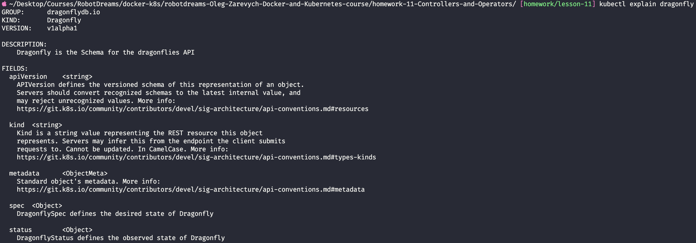
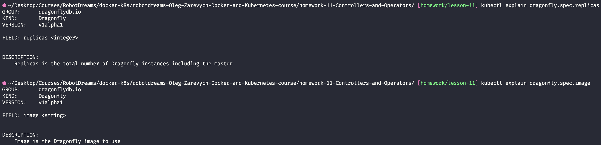
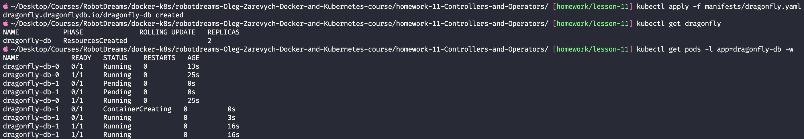
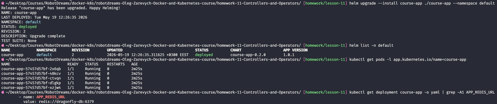
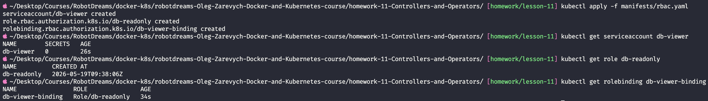
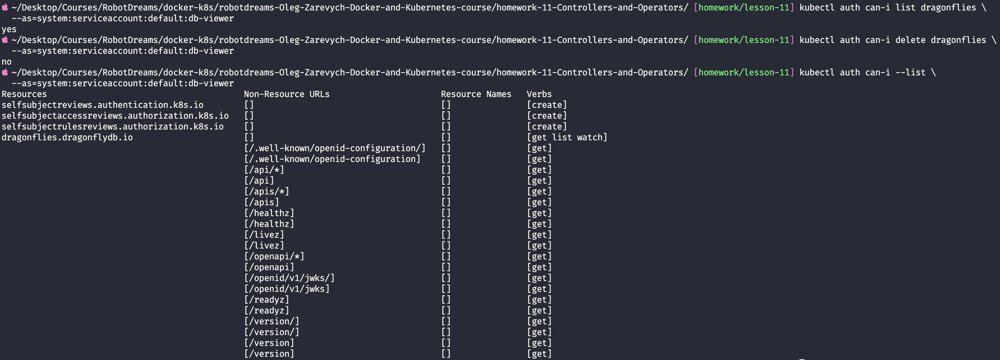

# Домашнє завдання #11 — Розширені можливості Kubernetes. Контролери та оператори

> Розгортання **Dragonfly** (Redis-сумісне сховище) через **operator pattern** і налаштування **RBAC** для Custom Resources.

## Зміст

- [Середовище](#середовище)
- [Теорія — навіщо потрібен Operator](#теорія--навіщо-потрібен-operator)
- [Завдання 1 — Dragonfly Operator](#завдання-1--dragonfly-operator)
  - [1.1 Встановлення оператора](#11-встановлення-оператора)
  - [1.2 Перевірка CRD](#12-перевірка-crd)
  - [1.3 Дослідження схеми (kubectl explain)](#13-дослідження-схеми-kubectl-explain)
  - [1.4 Маніфест dragonfly.yaml](#14-маніфест-dragonflyyaml)
  - [1.5 Застосування маніфесту](#15-застосування-маніфесту)
  - [1.6 Переключення course-app на Dragonfly](#16-переключення-course-app-на-dragonfly)
- [Завдання 2 — RBAC для Custom Resources](#завдання-2--rbac-для-custom-resources)
- [Завдання 3 — Верифікація (auth can-i)](#завдання-3--верифікація-auth-can-i)
- [Проблеми та їх вирішення](#проблеми-та-їх-вирішення)
- [Висновки](#висновки)

---

## Середовище

| Параметр       | Значення                         |
| -------------- | -------------------------------- |
| OS             | macOS (Apple Silicon, arm64)     |
| Kubernetes     | Docker Desktop (single-node)     |
| Helm           | 3.x                              |
| Operator       | Dragonfly Operator (dragonflydb) |
| Shell          | zsh                              |
| Дата виконання | 19 травня 2026                   |

> ⚠️ **Не плутати:** **DragonflyDB** (`dragonflydb.io`) — Redis-сумісне сховище, яке нам потрібне. Існує інший проєкт «Dragonfly» від `dragonflyoss` (`d7y.io`) — P2P-розповсюдження образів. Це різні речі.

---

## Теорія — навіщо потрібен Operator

Уся філософія Kubernetes — це машина **«бажане проти фактичного»**. Ти декларуєш бажаний стан, Kubernetes постійно намагається його забезпечити. Для вбудованих ресурсів (Deployment, Service) це роблять **вбудовані контролери** — наприклад, написав `replicas: 10`, упав под → контролер бачить «фактично 9, треба 10» → піднімає новий.

> 💡 **Аналогія:** Контролер — це **термостат**. Ти ставиш «хочу 22°C» (бажаний стан), термостат сам міряє фактичну температуру і вмикає/вимикає опалення. Ти не керуєш батареями вручну.

**Проблема:** вбудовані контролери знають лише загальні типи (под, сервіс). Вони не розуміють, що таке _БД з master-replica реплікацією_. Для них StatefulSet — просто «N однакових подів». Хто master, як робити failover, як промоутити нову master-ноду після збою — Kubernetes не має звідки знати.

**Operator pattern** розв'язує це, додаючи до кластера **власний контролер + власний тип ресурсу**:

| Частина                            | Що це                                                                                                  | Аналогія                                   |
| ---------------------------------- | ------------------------------------------------------------------------------------------------------ | ------------------------------------------ |
| **CRD** (CustomResourceDefinition) | навчає Kubernetes новому типу `Dragonfly`. Після цього `kubectl get dragonfly` працює як рідна команда | новий «бланк», який система тепер розуміє  |
| **Controller**                     | под, який у нескінченному циклі (**reconciliation loop**) звіряє бажане ↔ фактичне і виправляє різницю | інженер, що стежить за пультом і підкручує |

Reconciliation loop: **Watch** (стежить за CR) → **Compare** (бажане vs фактичне) → **Act** (створити под, промоутити master) → знову на крок 1, нескінченно.

> 💡 **Ключова ідея:** оператор не «хакає» Kubernetes. Він використовує штатну розширюваність: CRD — офіційний механізм додати тип, контролер — звичайний под зі звичайним доступом до API. Уся доменна «розумність» (як робити failover саме для Dragonfly) живе в коді контролера від DragonflyDB, а не в Kubernetes. Тому це **pattern** (спосіб мислення), а не вбудована фіча.

```
                          ┌──────────────────────┐
                          │  API-сервер + etcd   │
                          │  (зберігає бажане)   │
                          └──────────┬───────────┘
              1. watch / 2. compare  │  3. act
        ┌────────────────────────────┴─────────────────────────┐
        ▼                                                      ▼
┌───────────────────────┐                      ┌──────────────────────────┐
│ ns: dragonfly-        │                      │ ns: default              │
│     operator-system   │   створює/лагодить   │  Dragonfly (твій CR)     │
│  controller-manager   │ ───────────────────► │  ├─ pod: master          │
│  (reconciliation loop)│                      │  ├─ pod: replica         │
└───────────────────────┘                      │  └─ Service → master     │
                                               └──────────────────────────┘
```

---

## Завдання 1 — Dragonfly Operator

### 1.1 Встановлення оператора

Спершу планувалось ставити через офіційний Helm OCI-чарт (`oci://ghcr.io/dragonflydb/dragonfly-operator/helm`), але ghcr.io повертав `403 denied` для анонімного доступу до цього артефакту (детально — у розділі [Проблеми](#проблеми-та-їх-вирішення)). Тому використано **офіційно рекомендований** спосіб із документації DragonflyDB — консолідований маніфест:

```bash
kubectl apply -f https://raw.githubusercontent.com/dragonflydb/dragonfly-operator/main/manifests/dragonfly-operator.yaml
```

Один маніфест створює весь стек оператора:

| Ресурс                                                    | Призначення                                        |
| --------------------------------------------------------- | -------------------------------------------------- |
| `namespace/dragonfly-operator-system`                     | ізольоване місце для оператора                     |
| `customresourcedefinition .../dragonflies.dragonflydb.io` | **новий тип ресурсу** — основа Завдань 2 і 3       |
| `serviceaccount` + `clusterrole` + `clusterrolebinding`   | права оператора керувати своїми ресурсами          |
| `role/leader-election-role` + binding                     | leader election (якщо оператор у кількох репліках) |
| `deployment.apps/.../controller-manager`                  | сам контролер з reconciliation loop                |

Перевірка, що оператор піднявся:

```bash
kubectl get pods -n dragonfly-operator-system
```

Под `dragonfly-operator-controller-manager-...` має бути `2/2 Running` (два контейнери: `manager` + `kube-rbac-proxy` sidecar для захисту метрик).

### Скріншот



✅ Dragonfly Operator встановлено, controller-manager у статусі `2/2 Running`, `RESTARTS 0`.

---

### 1.2 Перевірка CRD

Оператор зареєстрував у кластері новий тип ресурсу. Перевіряємо:

```bash
kubectl api-resources | grep dragonfly
```

Вивід:

```
dragonflies          dragonflydb.io/v1alpha1          true          Dragonfly
```

> 💡 **Що це доводить:** Kubernetes API — це реєстр типів. До встановлення оператора команди `kubectl get dragonfly` не існувало. CRD динамічно додав новий endpoint — це і є момент «навчання» API-сервера.

Розбір виводу — критично для Завдання 2:

| Колонка    | Значення                  | Де знадобиться                                                |
| ---------- | ------------------------- | ------------------------------------------------------------- |
| NAME       | `dragonflies`             | ресурс у **множині** → `Role.resources`                       |
| APIVERSION | `dragonflydb.io/v1alpha1` | **API group `dragonflydb.io`** → `Role.apiGroups`             |
| NAMESPACED | `true`                    | прив'язаний до namespace → достатньо `Role`, не `ClusterRole` |
| KIND       | `Dragonfly`               | для `kind:` у маніфесті                                       |

### Скріншот



✅ CRD `dragonflies.dragonflydb.io` зареєстровано. API group — `dragonflydb.io`.

---

### 1.3 Дослідження схеми (kubectl explain)

`kubectl explain` читає схему ресурсу прямо з кластера — це джерело істини про те, які поля є і які обов'язкові (документація в інтернеті може бути від іншої версії CRD).

> 💡 **Аналогія:** `kubectl explain` — це як TypeScript-типи для Kubernetes-ресурсу. Замість гадати поля, дивишся в «інтерфейс».

```bash
kubectl explain dragonfly
kubectl explain dragonfly.spec
kubectl explain dragonfly.spec.replicas
kubectl explain dragonfly.spec.image
```

Структура така сама, як у будь-якого K8s-ресурсу: `apiVersion`, `kind`, `metadata`, `spec` (бажаний стан — пишемо ми), `status` (фактичний стан — заповнює контролер).

**Як читати обов'язковість:** у виводі `dragonfly.spec` біля кожного поля стоїть `(Optional)`. Виняток — два поля **без** цієї позначки:

| Поле                                                   | Тип         | Обов'язкове? | Доказ із виводу                                              |
| ------------------------------------------------------ | ----------- | ------------ | ------------------------------------------------------------ |
| `image`                                                | `<string>`  | **так**      | опис без `(Optional)`                                        |
| `replicas`                                             | `<integer>` | **так**      | опис без `(Optional)`, _"total number including the master"_ |
| `args`, `resources`, `authentication`, `snapshot`, ... | різні       | ні           | усі мають `(Optional)`                                       |

> 💡 **Важлива деталь з опису `replicas`:** _"total number of Dragonfly instances **including the master**"_. Тобто `replicas: 2` = 1 master + 1 replica, а не «1 master + 2 replicas».

### Скріншоти

Загальна структура типу `Dragonfly` (`apiVersion`, `kind`, `metadata`, `spec`, `status`):



Окремо поля `replicas` та `image` — обидва без позначки `(Optional)`, тобто обов'язкові:



✅ Схему досліджено. Обов'язкові поля — `image` та `replicas` (без позначки `(Optional)`).

---

### 1.4 Маніфест dragonfly.yaml

На основі `kubectl explain` складено маніфест `manifests/dragonfly.yaml` (повна версія з коментарями — у файлі):

```yaml
apiVersion: dragonflydb.io/v1alpha1 # GROUP/VERSION з kubectl explain
kind: Dragonfly
metadata:
  name: dragonfly-db
  namespace: default # там, де course-app
spec:
  replicas: 2 # обов'язкове. 2 = 1 master + 1 replica
  image: docker.dragonflydb.io/dragonflydb/dragonfly:latest # обов'язкове
  resources: # опційне, додано свідомо (локальний кластер)
    requests:
      cpu: "100m"
      memory: "256Mi"
    limits:
      cpu: "500m"
      memory: "512Mi"
```

| Поле          | Чому саме так                                                                                                          |
| ------------- | ---------------------------------------------------------------------------------------------------------------------- |
| `replicas: 2` | обов'язкове. `2` = master + replica → видно реплікацію і failover у дії                                                |
| `image`       | обов'язкове. Офіційний образ Dragonfly                                                                                 |
| `resources`   | опційне, але додано: на одновузловому Docker Desktop БД без лімітів може з'їсти забагато RAM. Принцип «дорослого коду» |

---

### 1.5 Застосування маніфесту

```bash
kubectl apply -f manifests/dragonfly.yaml
kubectl get dragonfly
kubectl get pods -l app=dragonfly-db -w
```

Вивід `kubectl get dragonfly`:

```
NAME          PHASE             ROLLING UPDATE   REPLICAS
dragonfly-db  ResourcesCreated                   2
```

> 💡 `PHASE: ResourcesCreated` — це поле `status`, яке заповнив **контролер**, не ми. Ми цього слова в YAML не писали — оператор відзвітував, що побачив CR і створив під нього ресурси. Живий доказ роботи reconciliation loop.

Поди піднялися **по черзі**, не одночасно:

```
dragonfly-db-0  0/1  Running           # master стартує
dragonfly-db-0  1/1  Running           # master готовий
dragonfly-db-1  0/1  Pending           # ТІЛЬКИ тепер з'являється replica
dragonfly-db-1  1/1  Running           # replica готова
```

> 💡 **Це і є «розумність» оператора:** він спершу дочекався готового master, і лише потім підняв replica, щоб підключити її до наявного master. Якби обидва піднялись одночасно — replica не знала б, до кого реплікуватись. Це знання про _саме Dragonfly_, якого Kubernetes не має — воно в коді контролера.

### Скріншот



✅ Інстанс `dragonfly-db` розгорнуто: `PHASE ResourcesCreated`, `REPLICAS 2`, обидва поди (master + replica) `1/1 Running`.

---

### 1.6 Переключення course-app на Dragonfly

Чарт `course-app` з homework-10 **скопійовано** в `homework-11/course-app/` (homework-10 не змінювалась — здана робота лишилась недоторканою; кожна домашка самодостатня). Логіку шаблонів не чіпали — змінено лише значення у `values.yaml`.

Спершу — точне ім'я Service, який створив оператор:

```bash
kubectl get svc | grep dragonfly
# dragonfly-db   ClusterIP   10.100.190.34   6379/TCP
```

Зміна у `course-app/values.yaml` (`app.redisHost`):

| Домашка         | redisHost          | Сховище                          |
| --------------- | ------------------ | -------------------------------- |
| homework-09     | `redis`            | власний Redis-под                |
| homework-10     | `redis-master`     | Bitnami Redis (Helm)             |
| **homework-11** | **`dragonfly-db`** | **Dragonfly (operator pattern)** |

> 💡 **Чому підміна безшовна:** Dragonfly реалізує той самий Redis wire-протокол і слухає той самий порт 6379. Для course-app це просто «хост:порт, куди я говорю мовою Redis» — застосунок не помічає, що під ним тепер зовсім інша БД.
>
> **Аналогія:** Redis-протокол — це стандарт розетки. Course-app — прилад із вилкою цього стандарту. Раніше вилка була в розетці «Bitnami Redis», тепер у розетці «Dragonfly». Прилад не змінюється — стандарт розетки той самий.

Розгортання (Ingress вимкнено — див. [Проблеми](#проблеми-та-їх-вирішення)):

```bash
helm upgrade --install course-app ./course-app --namespace default
helm list -n default
kubectl get pods -l app.kubernetes.io/name=course-app
kubectl get deployment course-app -o yaml | grep -A1 APP_REDIS_URL
```

Ключовий доказ переключення — фактичне значення env у задеплоєному Deployment:

```
- name: APP_REDIS_URL
  value: redis://dragonfly-db:6379
```

### Скріншот



✅ course-app переключено на Dragonfly: реліз `deployed`, 5 подів `Running`, `APP_REDIS_URL: redis://dragonfly-db:6379`. Підміну зроблено зміною одного значення у `values.yaml`, без правки коду застосунку чи шаблонів.

---

## Завдання 2 — RBAC для Custom Resources

Мета: створити «обмеженого спостерігача» — `ServiceAccount`, який **може дивитись** стан Dragonfly, але **не може** видалити чи переналаштувати.

> 💡 **Навіщо в реальності:** моніторинг-дашборду чи junior'у треба бачити стан БД (`kubectl get dragonfly`), але право `delete` на продакшн-базу — катастрофа, що чекає години. RBAC видає рівно потрібний доступ і ні граму більше — принцип **least privilege**.

Три сутності RBAC і навіщо їх саме три:

> 💡 **Аналогія — пропускна система офісу:**
>
> - **ServiceAccount** = співробітник (хто це). Бейдж сам нічого не відчиняє.
> - **Role** = список дозволів («можна заходити, дивитись»). Папірець, поки нікому не виданий.
> - **RoleBinding** = акт «видати співробітнику db-viewer повноваження зі списку db-readonly». Тільки після цього бейдж починає працювати.
>
> Три об'єкти, бо це гнучко: одну Role можна прив'язати до 10 SA, або одному SA дати кілька Role.

Маніфест `manifests/rbac.yaml` (повна версія з коментарями — у файлі):

```yaml
apiVersion: v1
kind: ServiceAccount
metadata:
  name: db-viewer
  namespace: default
---
apiVersion: rbac.authorization.k8s.io/v1
kind: Role
metadata:
  name: db-readonly
  namespace: default
rules:
  - apiGroups: ["dragonflydb.io"] # група з kubectl api-resources
    resources: ["dragonflies"] # ресурс У МНОЖИНІ (не kind!)
    verbs: ["get", "list", "watch"] # тільки читання
---
apiVersion: rbac.authorization.k8s.io/v1
kind: RoleBinding
metadata:
  name: db-viewer-binding
  namespace: default
subjects:
  - kind: ServiceAccount
    name: db-viewer
    namespace: default
roleRef:
  kind: Role
  name: db-readonly
  apiGroup: rbac.authorization.k8s.io
```

Чому `get`/`list`/`watch` = «тільки читання»:

| Verb    | Дозволяє                 |
| ------- | ------------------------ |
| `get`   | прочитати один об'єкт    |
| `list`  | прочитати список         |
| `watch` | підписка на зміни (`-w`) |

Жодного `delete`/`update`/`patch`/`create` → SA **фізично** не може нашкодити.

> 💡 **Найчастіша помилка тут** — написати `resources: ["dragonfly"]` (однина, як kind) або `["Dragonfly"]` (з великої). RBAC хоче точну назву ресурсу з `kubectl api-resources` — `dragonflies` (множина). Тому беремо з реального кластера, не з документації.

```bash
kubectl apply -f manifests/rbac.yaml
kubectl get serviceaccount db-viewer
kubectl get role db-readonly
kubectl get rolebinding db-viewer-binding
```

У виводі rolebinding колонка `ROLE` показує `Role/db-readonly` — підтвердження, що зв'язок встановлено.

### Скріншот



✅ Створено `ServiceAccount db-viewer`, `Role db-readonly` (`get`/`list`/`watch` на `dragonflies`), `RoleBinding db-viewer-binding` (вказує на `Role/db-readonly`).

---

## Завдання 3 — Верифікація (auth can-i)

`kubectl auth can-i ДІЯ РЕСУРС` запитує в API-сервера, чи дозволена дія — **без її виконання**. Прапорець `--as=` робить імперсонацію (запит від імені вказаного суб'єкта). Канонічне ім'я SA: `system:serviceaccount:<namespace>:<ім'я>`.

> 💡 **Чому це правильний інструмент, а не «спробувати реально видалити»:** реальний `kubectl delete --as=...` ризикований (раптом права ширші — і база видалиться) і брудний. `auth can-i` — це безпечний «сухий прогін», dry-run аудиту прав. Однозначно і повторювано.

```bash
# 1. Читання — має бути yes
kubectl auth can-i list dragonflies \
  --as=system:serviceaccount:default:db-viewer

# 2. Видалення — має бути no
kubectl auth can-i delete dragonflies \
  --as=system:serviceaccount:default:db-viewer

# 3. Бонус — повна матриця прав SA
kubectl auth can-i --list \
  --as=system:serviceaccount:default:db-viewer
```

Результати:

| Команда                         | Результат                                            | Що доводить                                    |
| ------------------------------- | ---------------------------------------------------- | ---------------------------------------------- |
| `auth can-i list dragonflies`   | **yes**                                              | права на читання видані коректно               |
| `auth can-i delete dragonflies` | **no**                                               | заборона руйнівних дій працює                  |
| `auth can-i --list`             | рядок `dragonflies.dragonflydb.io  [get list watch]` | точне дзеркало `verbs` з Role — нічого зайвого |

> 💡 Рядок `dragonflies.dragonflydb.io [get list watch]` у `--list` — найсильніший доказ: показує всю матрицю прав одразу, видно що нічого зайвого не просочилось. Решта рядків (`selfsubjectreviews`, `/healthz`, `/version`) — базовий мінімум будь-якого автентифікованого суб'єкта, не з нашої Role.

### Скріншот



✅ RBAC коректний: читання `yes`, видалення `no`, матриця прав на `dragonflies` — рівно `[get list watch]`.

---

## Проблеми та їх вирішення

### Проблема 1 — ghcr.io `403 denied` на Helm OCI-чарт

**Симптом:** `helm upgrade --install ... oci://ghcr.io/dragonflydb/dragonfly-operator/helm` падав з:

```
GET "https://ghcr.io/.../helm/manifests/1.5.0": ... 403: denied:
requested access to the resource is denied
```

**Діагностика (по кроках, не вгадування):**

1. Перевірено локальні креденшли (`~/.docker/config.json`) — стояв `credsStore: desktop`.
2. `docker logout ghcr.io` + `helm registry logout ghcr.io` — не допомогло.
3. Чистий pull без Docker-конфігу (`DOCKER_CONFIG=$(mktemp -d) helm pull ...`) — той самий `403`.
4. **Незалежна перевірка** голим curl на токен-endpoint без жодної авторизації:
   ```bash
   curl -s "https://ghcr.io/token?scope=repository:dragonflydb/dragonfly-operator/helm:pull&service=ghcr.io"
   # {"errors":[{"code":"DENIED","message":"requested access to the resource is denied"}]}
   ```

**Висновок:** `403` відтворюється навіть анонімним curl без участі локальної машини → проблема на стороні ghcr.io (артефакт не віддається анонімно), не в конфігурації клієнта.

**Рішення:** використано **офіційно рекомендований** спосіб з документації DragonflyDB — `kubectl apply` консолідованого маніфесту. Той самий результат (CRD + контролер у кластері), мета завдання виконана повністю. Спосіб встановлення не впливає на Завдання 2 і 3.

### Проблема 2 — Ingress admission webhook not found

**Симптом:** `helm install course-app` падав з:

```
failed calling webhook "validate.nginx.ingress.kubernetes.io":
service "ingress-nginx-controller-admission" not found
```

**Причина:** чарт містить `Ingress` (`ingress.enabled: true`). Kubernetes викликає admission webhook ingress-nginx для валідації, але контролер ingress-nginx у кластері відсутній (`kubectl get pods -n ingress-nginx` → `No resources found`) — кластер перестворювали після homework-08.

**Рішення:** `ingress.enabled: false` у `values.yaml`. Обґрунтування: Ingress дає лише _зовнішній_ доступ і не стосується теми homework-11 (оператори/RBAC) та перевірки Завдання 1.6. Шаблон Ingress навмисно умовний (`{{- if .Values.ingress.enabled }}`) — вимкнення прапорцем це штатний механізм чарту під середовище без ingress-nginx, а не правка коду. Перевірку course-app роблять через `APP_REDIS_URL` у Deployment (для зовнішнього доступу за потреби — `kubectl port-forward`).

---

## Висновки

### Статус завдань

| #   | Завдання                                   | Статус |
| --- | ------------------------------------------ | ------ |
| 1.1 | Встановити Dragonfly Operator              | ✅     |
| 1.2 | Перевірити появу CRD                       | ✅     |
| 1.3 | Дослідити схему через `kubectl explain`    | ✅     |
| 1.4 | Створити маніфест `dragonfly.yaml`         | ✅     |
| 1.5 | Застосувати маніфест, дочекатись подів     | ✅     |
| 1.6 | Переключити course-app на Dragonfly        | ✅     |
| 2   | Налаштувати RBAC (SA + Role + RoleBinding) | ✅     |
| 3   | Верифікувати через `kubectl auth can-i`    | ✅     |

### Ключові ідеї

| Концепція                  | Суть                                                                                      |
| -------------------------- | ----------------------------------------------------------------------------------------- |
| **Operator pattern**       | CRD навчає K8s новому ресурсу, Controller у reconciliation loop тримає бажаний стан       |
| **CRD**                    | `dragonflies.dragonflydb.io` — `kubectl get dragonfly` як рідний ресурс                   |
| **«Розумність» оператора** | послідовність «спершу master, потім replica» — доменне знання в коді контролера, не в K8s |
| **Redis-сумісність**       | course-app переключається без зміни коду — той самий протокол і порт 6379                 |
| **RBAC для CR**            | працює як для вбудованих; ключ — правильні `apiGroups` + `resources` (множина)            |
| **Least privilege**        | рівно `get`/`list`/`watch` — нічого зайвого; `auth can-i` це доводить                     |

### Корисні команди

```bash
# --- Operator ---
kubectl apply -f https://raw.githubusercontent.com/dragonflydb/dragonfly-operator/main/manifests/dragonfly-operator.yaml
kubectl get pods -n dragonfly-operator-system        # перевірити контролер (2/2)

# --- CRD та інстанси ---
kubectl api-resources | grep dragonfly               # знайти CRD + API group
kubectl explain dragonfly.spec                       # схема spec
kubectl explain dragonfly.spec.replicas              # конкретне поле
kubectl get dragonfly                                # список інстансів (PHASE)
kubectl describe dragonfly dragonfly-db              # деталі / events
kubectl apply -f manifests/dragonfly.yaml            # застосувати бажаний стан
kubectl patch dragonfly dragonfly-db --type merge \
  -p '{"spec":{"replicas":5}}'                       # масштабування через оператор

# --- course-app (Helm) ---
helm upgrade --install course-app ./course-app -n default
helm list -n default
kubectl get deployment course-app -o yaml | grep -A1 APP_REDIS_URL

# --- RBAC ---
kubectl apply -f manifests/rbac.yaml
kubectl get sa,role,rolebinding -n default
kubectl auth can-i list dragonflies \
  --as=system:serviceaccount:default:db-viewer       # очікуємо yes
kubectl auth can-i delete dragonflies \
  --as=system:serviceaccount:default:db-viewer       # очікуємо no
kubectl auth can-i --list \
  --as=system:serviceaccount:default:db-viewer       # повна матриця прав SA
```
